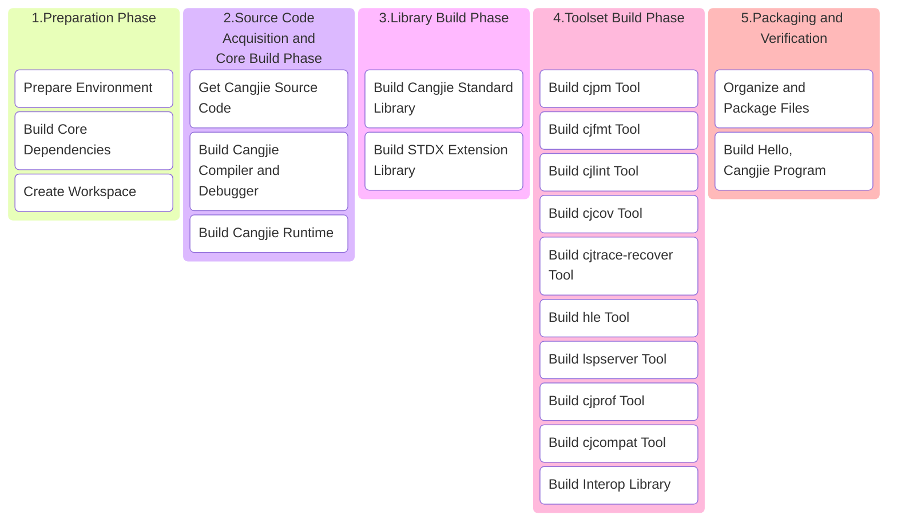

# Cangjie SDK Build Guide

## 1 Build Overview

This guide is designed to help users: set up the Cangjie SDK build environment in Linux systems and build a complete `linux-x64-android` Cangjie SDK with all components.

### 1.1 Build Process Overview



### 1.2 Key Notes

1. **Static Compilation (Optional)**: `cjdb` depends on `libedit` and ncurses. To ensure the generated Cangjie SDK runs stably on Linux distributions that meet the following conditions, you need to compile static versions of `libedit` and `ncurses` from source:
   - glibc version ≥ build environment version
   - Linux Kernel version matches the build environment
2. **Environment Isolation**: All custom dependencies are installed in `/opt/buildtools` to avoid polluting system paths
3. **Memory Requirements**: Full build requires ≥8GB memory, recommend adding 4GB swap space
4. **Android NDK Toolchain**: This guide uses Android NDK r26d as an example, supports Android 26+
5. **Network Requirements**: First build requires downloading approximately 3GB of data, please ensure stable network connection
6. **CPU Architecture**: x86_64

## 2 Environment Preparation

### 2.1 System Requirements

- **Operating System**: Ubuntu 22.04 LTS as an example, other versions can also refer to this process
- **Disk Space**: ≥50GB
- **Memory**: ≥8GB (physical memory + swap space)
- **User Permissions**: Regular user + sudo privileges

> You can choose to build Cangjie SDK based on our provided Docker environment. This docker is Ubuntu 18.04 with all system tools and build tools required for building Cangjie pre-installed:
>
> ```bash
> docker pull swr.cn-north-4.myhuaweicloud.com/cj-docker/cangjie_ubuntu18_x86_kernel:v2.9
> ```

### 2.2 System Tools Installation

- Using Huawei Mirror Source (Optional)

  ```bash
  # 1. Backup configuration file:
  sudo cp -a /etc/apt/sources.list /etc/apt/sources.list.bak;
  # 2. Modify sources.list file, replace http://archive.ubuntu.com and http://security.ubuntu.com with http://mirrors.huaweicloud.com, you can refer to the following command:
  sudo sed -i "s@http://.*archive.ubuntu.com@http://mirrors.huaweicloud.com@g" /etc/apt/sources.list;
  sudo sed -i "s@http://.*security.ubuntu.com@http://mirrors.huaweicloud.com@g" /etc/apt/sources.list;
  # 3. Update index
  sudo apt-get update;
  ```

- Install System Tools

  ```bash
  sudo apt update && sudo apt install -y \
    tar unzip wget curl libcurl4 expat openssl make gcc g++ gettext \
    nfs-common libtool sqlite3 zlib1g-dev libssl-dev cmake ninja-build\
    libcurl4-openssl-dev sudo autoconf build-essential rapidjson-dev \
    texinfo binutils expat libelf-dev libdwarf-dev openssh-client ssh \
    dos2unix libxext-dev libxtst-dev libxt-dev libcups2-dev clang clang-15 libedit-dev\
    libxrender-dev zip bzip2 libopenmpi-dev vim gdb lldb libclang-15-dev libgtest-dev\
    rpm patch libtinfo5 cpio rpm2cpio libncurses5 libncurses5-dev strace net-tools swig;
  ```

### 2.3 Static Library Compilation (Optional)

The libedit and ncurses libraries **are not required to be compiled from source**; you can also use system pre-compiled versions.

Preparation:

```bash
# Build tools directory
export BUILD_ROOT=/opt/buildtools;
sudo mkdir -p $BUILD_ROOT;
sudo chown $USER:$USER $BUILD_ROOT;
tmp_cpus=$(grep -w processor /proc/cpuinfo|wc -l);
```

#### (1) Compile ncurses 6.5 (Static)

```bash
cd $BUILD_ROOT;
git clone https://gitcode.com/openharmony/third_party_ncurses.git -b OpenHarmony-v6.0-Release ncurses-6.5;
cd ncurses-6.5;
./configure --with-termlib CC=clang CXX=clang++ CFLAGS=-fPIC CPPFLAGS=-fPIC CFLAGS="-fstack-protector-strong -Wl,-z,relro,-z,now,-z,noexecstack" CXXFLAGS="-fstack-protector-strong -Wl,-z,relro,-z,now,-z,noexecstack" --with-terminfo-dirs=/etc/terminfo:/lib/terminfo:/usr/share/terminfo --disable-widec --disable-overwrite --disable-root-environ;
make -j ${tmp_cpus};
make install DESTDIR=${BUILD_ROOT}/ncurses-6.5;
```

#### (2) Compile libedit 3.1 (Static)

```bash
cd $BUILD_ROOT;
git clone https://gitcode.com/openharmony/third_party_libedit.git -b OpenHarmony-5.0.0-Release;
cd third_party_libedit && tar xf libedit-20210910-3.1.tar.gz;
cd libedit-20210910-3.1;
./configure --with-pic --enable-shared=no --prefix=${BUILD_ROOT}/libedit-3.1;
make -j ${tmp_cpus};
make install;
```

### 2.4 Install Android NDK r26d

```bash
install_dir=/opt/buildtools/android-ndk-r26d
mkdir -p ${install_dir}
tmp_cpus=$(grep -w processor /proc/cpuinfo|wc -l)

wget https://dl.google.com/android/repository/android-ndk-r26d-linux.zip -q --no-check-certificate;
git clone https://gitcode.com/openharmony/third_party_openssl.git -b OpenHarmony-v6.0-Release openssl-3.0.9

unzip -qo android-ndk-r26d-linux.zip
mv android-ndk-r26d/* ${install_dir}
export PATH="$install_dir/toolchains/llvm/prebuilt/linux-x86_64/bin:$PATH"
export ANDROID_NDK_ROOT=${install_dir}
mkdir -p ${install_dir}/toolchains/llvm/prebuilt/linux-x86_64/sysroot/usr/local
ls -l ${install_dir}/toolchains/llvm/prebuilt/linux-x86_64/sysroot/usr/

cd openssl-3.0.9
# configuring
mkdir -p build
cd build
../Configure android-arm64 -D__ANDROID_API__=31 --prefix=${install_dir}/toolchains/llvm/prebuilt/linux-x86_64/sysroot/usr/local --with-zlib-include=${install_dir}/toolchains/llvm/prebuilt/linux-x86_64/sysroot/usr/include --with-zlib-lib=${install_dir}/toolchains/llvm/prebuilt/linux-x86_64/sysroot/usr/lib
# building
make -j $tmp_cpus
make install_sw
```

### 2.5 Set Environment Variables

#### (1) OpenSSL Environment Variable Setup

Building Cangjie standard library depends on OpenSSL 3+. In the previous section (2.2 System Tools Installation - Install System Tools), we have already installed the OpenSSL library. Now we need to set the `OPENSSL_PATH` environment variable:

 - Locate OpenSSL lib directory

   Library file location: Default in `/usr/lib/x86_64-linux-gnu/` (x86_64), verification method:

   ```bash
   # Find libssl.so
   ls /usr/lib/x86_64-linux-gnu/libssl.so*
   # Find libcrypto.so
   ls /usr/lib/x86_64-linux-gnu/libcrypto.so*
   ```

 - Set OPENSSL_PATH environment variable

   **<font color="red">\* Replace `/path/to/openssl-3.x` in the example below with your `openssl` lib directory</font>**

   ```bash
   export OPENSSL_PATH=/path/to/openssl-3.x
   export LD_LIBRARY_PATH=$OPENSSL_PATH:$LD_LIBRARY_PATH
   ```

- If you are using the official image, you can use the following settings

  ```bash
  # x86_64
  export OPENSSL_PATH=${BUILD_ROOT}/openssl-3.0.9/lib64;
  ```

#### (2) Other Environment Variable Setup

Before proceeding with subsequent steps, configure the following environment variables:

```bash
export PATH=/usr/lib/llvm-15/bin:$PATH; # Add clang-15 to environment variables
export ANDROID_NDK_ROOT=/opt/buildtools/android-ndk-r26d
# Architecture name
export ARCH=x86_64 # or aarch64
# Cangjie SDK version number
export CANGJIE_VERSION=1.0.0
# Stdx version number
export STDX_VERSION=1
export SDK_NAME=linux-x64-android
```

## 3. Source Code Preparation

### 3.1 Create Workspace

**<font color="red">\* Replace `/path/to/workspace` in the example below with your workspace directory for building Cangjie SDK</font>**

```bash
export WORKSPACE=/path/to/workspace
mkdir -p $WORKSPACE;
cd $WORKSPACE;
```

### 3.2 Get Cangjie Source Code

```bash
git clone https://gitcode.com/Cangjie/cangjie_compiler.git -b main;
git clone https://gitcode.com/Cangjie/cangjie_runtime.git -b main;
git clone https://gitcode.com/Cangjie/cangjie_tools.git -b main;
git clone https://gitcode.com/Cangjie/cangjie_stdx.git -b main;
git clone https://gitcode.com/Cangjie/cangjie_multiplatform_interop.git -b main;
```

## 4 Build Process

### 4.1 Build Cangjie Compiler and Debugger

> You can use your compiled static libraries (optional) via `CMAKE_PREFIX_PATH` and `--target-lib`

```bash
export CMAKE_PREFIX_PATH=$BUILD_ROOT/libedit-3.1:$BUILD_ROOT/ncurses-6.5/usr;
```

Execute build:

```bash
cd $WORKSPACE/cangjie_compiler;
python3 build.py clean;
python3 build.py build -t release \
  -v ${CANGJIE_VERSION} \
  --no-tests \
  --target-lib=$BUILD_ROOT/ncurses-6.5/usr/lib \
  --build-cjdb;
python3 build.py build -t release \
  --target android26-aarch64 \
  --android-ndk ${ANDROID_NDK_ROOT};
python3 build.py install;
```

Verify installation:
```bash
source output/envsetup.sh;
cjc -v;
```

### 4.2 Build Cangjie Runtime

```bash
cd $WORKSPACE/cangjie_runtime/runtime;
python3 build.py clean;
python3 build.py build -t release -v ${CANGJIE_VERSION};
python3 build.py install;
python3 build.py build -t release \
  --target android26-aarch64 \
  --target-toolchain ${ANDROID_NDK_ROOT}/toolchains \
    -v ${CANGJIE_VERSION};
python3 build.py install;
cp -R output/common/linux_release_x86_64/{lib,runtime}          ${WORKSPACE}/cangjie_compiler/output;
cp -R output/common/linux_android_release_aarch64/{lib,runtime} ${WORKSPACE}/cangjie_compiler/output;

```

### 4.3 Build Cangjie Standard Library

```bash
cd $WORKSPACE/cangjie_runtime/stdlib;
python3 build.py clean;
python3 build.py build -t release \
  --target-lib=$WORKSPACE/cangjie_runtime/runtime/output \
  --target-lib=$OPENSSL_PATH;
python3 build.py build -t release\
  --target android26-aarch64 \
  --target-lib=${WORKSPACE}/cangjie_runtime/runtime/output \
  --target-toolchain ${ANDROID_NDK_ROOT}/toolchains/llvm/prebuilt/linux-x86_64/bin
python3 build.py install;
cp -R $WORKSPACE/cangjie_runtime/stdlib/output/* ${WORKSPACE}/cangjie_compiler/output/;
```

### 4.4 Build STDX Extension Library

```bash
cd ${WORKSPACE}/cangjie_stdx;
python3 build.py clean;
python3 build.py build -t release \
  --include=${WORKSPACE}/cangjie_compiler/include \
  --target-toolchain ${ANDROID_NDK_ROOT}/toolchains/llvm/prebuilt/linux-x86_64/bin \
  --target android26-aarch64;

python3 build.py install;
export CANGJIE_STDX_PATH=${WORKSPACE}/cangjie_stdx/target/linux_android_aarch64_cjnative/static/stdx;
```

### 4.5 Build Toolset

#### (1) cjpm

```bash
cd ${WORKSPACE}/cangjie_tools/cjpm/build;
python3 build.py clean;
python3 build.py build -t release --set-rpath \$ORIGIN/../../runtime/lib/linux_${ARCH}_cjnative;
python3 build.py install;
mkdir -p ${WORKSPACE}/cangjie_compiler/output/tools/config;
cp ${WORKSPACE}/cangjie_tools/cjpm/dist/cjpm   ${WORKSPACE}/cangjie_compiler/output/tools/bin;
mv ${WORKSPACE}/cangjie_tools/cjpm/dist/*.toml ${WORKSPACE}/cangjie_compiler/output/tools/config;
```

#### (2) cjfmt

```bash
cd ${WORKSPACE}/cangjie_tools/cjfmt/build;
python3 build.py clean;
python3 build.py build -t release;
python3 build.py install;
mv ${WORKSPACE}/cangjie_tools/cjfmt/build/build/bin/cjfmt ${WORKSPACE}/cangjie_compiler/output/tools/bin;
mv ${WORKSPACE}/cangjie_tools/cjfmt/config/*.toml         ${WORKSPACE}/cangjie_compiler/output/tools/config;
```

#### (3) cjlint

```bash
cd ${WORKSPACE}/cangjie_tools/cjlint/build;
python3 build.py clean;
python3 build.py build -t release;
python3 build.py install;
mv ${WORKSPACE}/cangjie_tools/cjlint/dist/bin/cjlint ${WORKSPACE}/cangjie_compiler/output/tools/bin
mv ${WORKSPACE}/cangjie_tools/cjlint/dist/lib/*      ${WORKSPACE}/cangjie_compiler/output/tools/lib
mv ${WORKSPACE}/cangjie_tools/cjlint/dist/config/*   ${WORKSPACE}/cangjie_compiler/output/tools/config
```

#### (4) cjcov

```bash
cd ${WORKSPACE}/cangjie_tools/cjcov/build;
python3 build.py clean;
python3 build.py build -t release;
python3 build.py install;
mv ${WORKSPACE}/cangjie_tools/cjcov/dist/cjcov ${WORKSPACE}/cangjie_compiler/output/tools/bin;
```

#### (5) cjtrace-recover

```bash
cd ${WORKSPACE}/cangjie_tools/cjtrace-recover/build;
python3 build.py clean;
python3 build.py build -t release;
python3 build.py install --prefix ${WORKSPACE}/cangjie_compiler/output/tools;
```

#### (6) HyperLangExtension

```bash
cd $WORKSPACE/cangjie_tools/hyperlangExtension/build;
python3 build.py clean;
python3 build.py build -t release;
python3 build.py install;
cp ${WORKSPACE}/cangjie_tools/hyperlangExtension/target/bin/main  ${WORKSPACE}/cangjie_compiler/output/tools/bin/hle;
cp -R ${WORKSPACE}/cangjie_tools/hyperlangExtension/src/dtsparser ${WORKSPACE}/cangjie_compiler/output/tools;
rm -rf ${WORKSPACE}/cangjie_compiler/output/tools/dtsparser/*.cj;
```

#### (7) LSP Server

```bash
cd $WORKSPACE/cangjie_tools/cangjie-language-server/build;
python3 build.py clean;
python3 build.py build -t release;
python3 build.py install;
cp ${WORKSPACE}/cangjie_tools/cangjie-language-server/output/bin/LSPServer ${WORKSPACE}/cangjie_compiler/output/tools/bin
```

#### (8) cjprof

```bash
cd ${WORKSPACE}/cangjie_tools/cjprof/build;
python3 build.py build -t release;
python3 build.py install;
cp $WORKSPACE/cangjie_tools/cjprof/dist/bin/cjprof ${WORKSPACE}/cangjie_compiler/output/tools/bin
cp $WORKSPACE/cangjie_tools/cjprof/dist/lib/* ${WORKSPACE}/cangjie_compiler/output/tools/lib
if [[ -d "$WORKSPACE/cangjie_tools/cjprof/static" ]]; then
  cp -Rf $WORKSPACE/cangjie_tools/cjprof/static cangjie/tools/config;
fi
```

#### (9) cjcompat

```bash
cd ${WORKSPACE}/cangjie_tools/cjcompat/build;
python3 build.py build -t release;
python3 build.py install;
cp $WORKSPACE/cangjie_tools/cjcompat/dist/bin/cjcompat ${WORKSPACE}/cangjie_compiler/output/tools/bin
```

#### (10) Java Interop

```bash
cd ${WORKSPACE}/cangjie_multiplatform_interop/java/build
# java-mirror-gen
python3 build.py clean;
python3 build.py build;
python3 build.py install --prefix ${WORKSPACE}/cangjie_compiler/output;

# interoplib linux_x86_64
python3 build.py clean;
python3 build.py build --target-lib linux_x86_64_cjnative;
python3 build.py install --target linux_x86_64 --prefix ${WORKSPACE}/cangjie_compiler/output;

# interoplib aarch64-linux-android
export PATH=${ANDROID_NDK_ROOT}/toolchains/llvm/prebuilt/linux-x86_64/bin:$PATH;
source ${WORKSPACE}/cangjie_compiler/output/envsetup.sh;
python3 build.py clean;
python3 build.py build -t release \
  --target aarch64-linux-android26 \
  --target-sysroot ${ANDROID_NDK_ROOT}/toolchains/llvm/prebuilt/linux-x86_64/sysroot \
  --target-toolchain ${ANDROID_NDK_ROOT}/toolchains/llvm/prebuilt/linux-x86_64/bin \
  --target-lib linux_android_aarch64_cjnative;
python3 build.py install --target linux_android_aarch64 --prefix ${WORKSPACE}/cangjie_compiler/output;
```

## 5 Organize and Package Files

### 5.1 Organize and Package SDK

```bash
# Clear previous builds
mkdir -p $WORKSPACE/software;
rm -rf $WORKSPACE/software/*;
cd $WORKSPACE/software;

# Copy cangjie directory
cp -R $WORKSPACE/cangjie_compiler/output cangjie;
cp $WORKSPACE/cangjie_compiler/LICENSE cangjie;
cp $WORKSPACE/cangjie_compiler/Open_Source_Software_Notice.docx cangjie;

# Package and set permissions
chmod -R 750 cangjie
tar --format=gnu -zcvf cangjie-sdk-${SDK_NAME}-${CANGJIE_VERSION}.tar.gz cangjie;
chmod 550 cangjie-sdk-${SDK_NAME}-${CANGJIE_VERSION}.tar.gz;
```

### 5.2 Organize and Package Stdx

```bash
cd $WORKSPACE/software;
# Copy stdx directory
cp -r $WORKSPACE/cangjie_stdx/target/linux_android_aarch64_cjnative .;
cp $WORKSPACE/cangjie_stdx/LICENSE linux_android_aarch64_cjnative;
cp $WORKSPACE/cangjie_stdx/Open_Source_Software_Notice.docx linux_android_aarch64_cjnative;
chmod -R 750 linux_android_aarch64_cjnative;
zip -qr cangjie-stdx-android-aarch64-${CANGJIE_VERSION}.${STDX_VERSION}.zip linux_android_aarch64_cjnative;
chmod 550 cangjie-stdx-android-aarch64-${CANGJIE_VERSION}.${STDX_VERSION}.zip;
```

## 6 Build Hello, Cangjie Program

Check generated files:

```bash
ls -lh $WORKSPACE/software
# Should include:
# - cangjie-sdk-${SDK_NAME}-${CANGJIE_VERSION}.tar.gz
# - cangjie-stdx-android-aarch64-${CANGJIE_VERSION}.${STDX_VERSION}.zip
```

Verify Hello, Cangjie program:

```bash
cd $WORKSPACE;
source $WORKSPACE/software/cangjie/envsetup.sh;
echo "main() { println(\"Hello, Cangjie\") }" > hello.cj
cjc hello.cj -o hello && ./hello
# You will see the following output in the console:
# Hello, Cangjie
```

🎉 Congratulations on successfully building the Cangjie SDK and running the Hello, Cangjie program!

