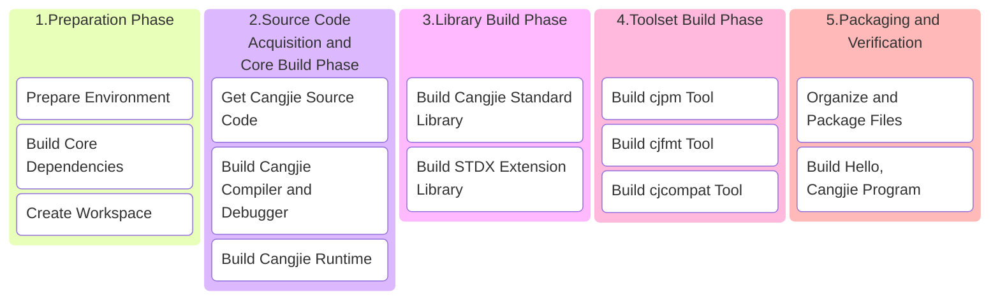

# Cangjie SDK Build Guide

## 1 Build Overview

This guide is designed to help users: set up the Cangjie SDK build environment in Linux systems and build a complete `ohos-aarch64` Cangjie SDK with all components.

### 1.1 Build Process Overview



### 1.2 Key Notes

1. **Environment Isolation**: All custom dependencies are installed in `/opt/buildtools` to avoid polluting system paths
2. **Memory Requirements**: Full build requires ≥8GB memory, recommend adding 4GB swap space
3. **Network Requirements**: First build requires downloading approximately 3GB of data, please ensure stable network connection
4. **CPU Architecture**: x86_64

## 2 Environment Preparation

### 2.1 System Requirements

- **Operating System**: Ubuntu 22.04 LTS as an example, other versions can also refer to this process
- **Disk Space**: ≥50GB
- **Memory**: ≥8GB (physical memory + swap space)
- **User Permissions**: Regular user + sudo privileges

> You can choose to build Cangjie SDK based on our provided Docker environment. This docker is Ubuntu 18.04 with all system tools and build tools required for building Cangjie pre-installed:
>
> ```bash
> docker pull swr.cn-north-4.myhuaweicloud.com/cj-docker/cangjie_ubuntu18_x86_kernel:v2.9
> ```

### 2.2 System Tools Installation

- Using Huawei Mirror Source (Optional)

  ```bash
  # 1. Backup configuration file:
  sudo cp -a /etc/apt/sources.list /etc/apt/sources.list.bak;
  # 2. Modify sources.list file, replace http://archive.ubuntu.com and http://security.ubuntu.com with http://mirrors.huaweicloud.com, you can refer to the following command:
  sudo sed -i "s@http://.*archive.ubuntu.com@http://mirrors.huaweicloud.com@g" /etc/apt/sources.list;
  sudo sed -i "s@http://.*security.ubuntu.com@http://mirrors.huaweicloud.com@g" /etc/apt/sources.list;
  # 3. Update index
  sudo apt-get update;
  ```

- Install System Tools

  ```bash
  sudo apt update && sudo apt install -y \
    tar unzip wget curl libcurl4 expat openssl make gcc g++ gettext \
    nfs-common libtool sqlite3 zlib1g-dev libssl-dev cmake ninja-build\
    libcurl4-openssl-dev sudo autoconf build-essential rapidjson-dev \
    texinfo binutils expat libelf-dev libdwarf-dev openssh-client ssh \
    dos2unix libxext-dev libxtst-dev libxt-dev libcups2-dev clang clang-15 libedit-dev\
    libxrender-dev zip bzip2 libopenmpi-dev vim gdb lldb libclang-15-dev libgtest-dev\
    rpm patch libtinfo5 cpio rpm2cpio libncurses5 libncurses5-dev strace net-tools swig;
  ```

### 2.3. Build ohos-x86_64, ohos-aarch64 Toolchain

[Please refer to Building ohos-aarch64 Toolchain](linux_ohos_toolchain.md)

```bash
export OHOS_ROOT=/opt/buildtools/ohos_root;
```

If you are using the official image, you can use the following settings

```bash
export OHOS_ROOT=/opt/buildtools/ohos/ohos_root;
```

### 2.4 Set Environment Variables

#### (1) OpenSSL Environment Variable Setup

Building Cangjie standard library depends on OpenSSL 3+. In the previous section (2.2 System Tools Installation - Install System Tools), we have already installed the OpenSSL library. Now we need to set the `OPENSSL_PATH` environment variable:

 - Locate OpenSSL lib directory

   Library file location: Default in `/usr/lib/x86_64-linux-gnu/` (x86_64), verification method:

   ```bash
   # Find libssl.so
   ls /usr/lib/x86_64-linux-gnu/libssl.so*
   # Find libcrypto.so
   ls /usr/lib/x86_64-linux-gnu/libcrypto.so*
   ```

 - Set OPENSSL_PATH environment variable

   **<font color="red">\* Replace `/path/to/openssl-3.x` in the example below with your `openssl` lib directory</font>**

   ```bash
   export OPENSSL_PATH=/path/to/openssl-3.x
   export LD_LIBRARY_PATH=$OPENSSL_PATH:$LD_LIBRARY_PATH
   ```

- If you are using the official image, you can use the following settings

  ```bash
  # x86_64
  export OPENSSL_PATH=${BUILD_ROOT}/openssl-3.0.9/lib64;
  ```

#### (2) Other Environment Variable Setup

Before proceeding with subsequent steps, configure the following environment variables:

```bash
export PATH=/usr/lib/llvm-15/bin:$PATH; # Add clang-15 to environment variables
# Architecture name
export ARCH=x86_64 # or aarch64
# Cangjie SDK version number
export CANGJIE_VERSION=1.0.0
# Stdx version number
export STDX_VERSION=1
export SDK_NAME=ohos-aarch64
```

## 3. Source Code Preparation

### 3.1 Create Workspace

**<font color="red">\* Replace `/path/to/workspace` in the example below with your workspace directory for building Cangjie SDK</font>**

```bash
export WORKSPACE=/path/to/workspace
mkdir -p $WORKSPACE;
cd $WORKSPACE;
```

### 3.2 Get Cangjie Source Code

```bash
git clone https://gitcode.com/Cangjie/cangjie_compiler.git -b main;
git clone https://gitcode.com/Cangjie/cangjie_runtime.git -b main;
git clone https://gitcode.com/Cangjie/cangjie_tools.git -b main;
git clone https://gitcode.com/Cangjie/cangjie_stdx.git -b main;
```

## 4 Build Process

### 4.1 Build Cangjie Compiler and Debugger

> Execute build:

```bash
cd $WORKSPACE/cangjie_compiler;
python3 build.py clean;
python3 build.py build -t release --no-tests -v ${CANGJIE_VERSION};
python3 build.py build -t release \
  -v ${CANGJIE_VERSION} \
  --product cjc \
  --no-tests \
  --target ohos-aarch64 \
  --target-toolchain ${OHOS_ROOT}/prebuilts/clang/ohos/linux-x86_64/llvm/bin \
  --target-sysroot ${OHOS_ROOT}/out/sdk/obj/third_party/musl/sysroot \
  --build-cjdb;
python3 build.py build -t release \
  --product libs \
  --target ohos-aarch64 \
  --target-toolchain ${OHOS_ROOT}/prebuilts/clang/ohos/linux-x86_64/llvm/bin \
  --target-sysroot ${OHOS_ROOT}/out/sdk/obj/third_party/musl/sysroot;
python3 build.py install;
python3 build.py install --host ohos-aarch64;
cp -Rn output-aarch64-linux-ohos/* output;
```

Verify installation:
```bash
source output/envsetup.sh;
cjc -v;
```

### 4.2 Build Cangjie Runtime

```bash
cd $WORKSPACE/cangjie_runtime/runtime;
python3 build.py clean;
python3 build.py build -t release -v ${CANGJIE_VERSION};
python3 build.py install;
python3 build.py build -t release \
  --target ohos-aarch64 \
  --target-toolchain ${OHOS_ROOT} \
  -v ${CANGJIE_VERSION};
python3 build.py install;
cp -R output/common/linux_release_x86_64/{lib,runtime}       ${WORKSPACE}/cangjie_compiler/output;
cp -R output/common/linux_ohos_release_aarch64/{lib,runtime} ${WORKSPACE}/cangjie_compiler/output;
cp -R output/common/linux_ohos_release_aarch64/{lib,runtime} ${WORKSPACE}/cangjie_compiler/output-aarch64-linux-ohos;
```

### 4.3 Build Cangjie Standard Library

```bash
cd $WORKSPACE/cangjie_runtime/stdlib;
python3 build.py clean;
python3 build.py build -t release \
  --target-lib=$WORKSPACE/cangjie_runtime/runtime/output \
  --target-lib=$OPENSSL_PATH;
python3 build.py build -t release \
  --target ohos-aarch64 \
  --target-lib=${WORKSPACE}/cangjie_runtime/runtime/output \
  --target-toolchain ${OHOS_ROOT}/prebuilts/clang/ohos/linux-x86_64/llvm/bin \
  --target-sysroot ${OHOS_ROOT}/out/sdk/obj/third_party/musl/sysroot;
python3 build.py install;
cp -R output/* ${WORKSPACE}/cangjie_compiler/output/;
cp -R output/* ${WORKSPACE}/cangjie_compiler/output-aarch64-linux-ohos;
```

### 4.4 Build STDX Extension Library

```bash
cd ${WORKSPACE}/cangjie_stdx;
python3 build.py clean;
python3 build.py build -t release \
  --target-lib=${OPENSSL_PATH} \
  --target ohos-aarch64 \
  --target-sysroot ${OHOS_ROOT}/out/sdk/obj/third_party/musl/sysroot \
  --target-toolchain ${OHOS_ROOT}/prebuilts/clang/ohos/linux-x86_64/llvm/bin;
python3 build.py install;
export CANGJIE_STDX_PATH=${WORKSPACE}/cangjie_stdx/target/linux_ohos_aarch64_cjnative/static/stdx;
```

### 4.5 Build Toolset

#### (1) cjpm

```bash
cd ${WORKSPACE}/cangjie_tools/cjpm/build;
python3 build.py clean;
python3 build.py build -t release --target ohos-aarch64;
python3 build.py install;
mkdir -p ${WORKSPACE}/cangjie_compiler/output-aarch64-linux-ohos/tools/config;
cp $WORKSPACE/cangjie_tools/cjpm/dist/cjpm   ${WORKSPACE}/cangjie_compiler/output-aarch64-linux-ohos/tools/bin;
mv $WORKSPACE/cangjie_tools/cjpm/dist/*.toml ${WORKSPACE}/cangjie_compiler/output-aarch64-linux-ohos/tools/config;
```

#### (2) cjfmt

```bash
source ${WORKSPACE}/cangjie_compiler/output-aarch64-linux-ohos/envsetup.sh;
export PATH=${OHOS_ROOT}/prebuilts/clang/ohos/linux-x86_64/llvm/bin:$PATH; # Add ohos toolchain to environment variables
cd ${WORKSPACE}/cangjie_tools/cjfmt/build;
python3 build.py clean;
python3 build.py build -t release --target ohos-aarch64 --target-sysroot ${OHOS_ROOT}/out/sdk/obj/third_party/musl/sysroot;
python3 build.py install;
cp $WORKSPACE/cangjie_tools/cjfmt/build/build/bin/cjfmt ${WORKSPACE}/cangjie_compiler/output-aarch64-linux-ohos/tools/bin;
cp $WORKSPACE/cangjie_tools/cjfmt/config/*.toml         ${WORKSPACE}/cangjie_compiler/output-aarch64-linux-ohos/tools/config;
```

#### (3) cjprof

```bash
cd ${WORKSPACE}/cangjie_tools/cjprof/build;
python3 build.py build -t release;
python3 build.py install;
cp $WORKSPACE/cangjie_tools/cjprof/dist/bin/cjprof ${WORKSPACE}/cangjie_compiler/output-aarch64-linux-ohos/tools/bin
cp $WORKSPACE/cangjie_tools/cjprof/dist/lib/* ${WORKSPACE}/cangjie_compiler/output-aarch64-linux-ohos/tools/lib;
if [[ -d "$WORKSPACE/cangjie_tools/cjprof/static" ]]; then
  cp -Rf $WORKSPACE/cangjie_tools/cjprof/static cangjie/tools/config;
fi
```

#### (4) cjcompat

```bash
cd ${WORKSPACE}/cangjie_tools/cjcompat/build;
python3 build.py build -t release;
python3 build.py install;
cp $WORKSPACE/cangjie_tools/cjcompat/dist/bin/cjcompat ${WORKSPACE}/cangjie_compiler/output-aarch64-linux-ohos/tools/bin
```

## 5 Organize and Package Files

### 5.1 Organize and Package SDK

```bash
# Clear previous builds
mkdir -p $WORKSPACE/software;
rm -rf $WORKSPACE/software/*;
cd $WORKSPACE/software;

# Copy cangjie directory
cp -R $WORKSPACE/cangjie_compiler/output-aarch64-linux-ohos cangjie;
cp $WORKSPACE/cangjie_compiler/LICENSE cangjie;
cp $WORKSPACE/cangjie_compiler/Open_Source_Software_Notice.docx cangjie;

# Package and set permissions
chmod -R 750 cangjie
tar --format=gnu -zcvf cangjie-sdk-${SDK_NAME}-${CANGJIE_VERSION}.tar.gz cangjie;
chmod 550 cangjie-sdk-${SDK_NAME}-${CANGJIE_VERSION}.tar.gz;
```

### 5.2 Organize and Package Stdx

```bash
cd $WORKSPACE/software;
# Copy stdx directory
cp -r $WORKSPACE/cangjie_stdx/target/linux_ohos_aarch64_cjnative .;
cp $WORKSPACE/cangjie_stdx/LICENSE linux_ohos_aarch64_cjnative;
cp $WORKSPACE/cangjie_stdx/Open_Source_Software_Notice.docx linux_ohos_aarch64_cjnative;
chmod -R 750 linux_ohos_aarch64_cjnative;
zip -qr cangjie-stdx-${SDK_NAME}-${CANGJIE_VERSION}.${STDX_VERSION}.zip linux_${ARCH}_cjnative;
chmod 550 cangjie-stdx-${SDK_NAME}-${CANGJIE_VERSION}.${STDX_VERSION}.zip;
```

## 6 Build Hello, Cangjie Program

Check generated files:

```bash
ls -lh $WORKSPACE/software
# Should include:
# - cangjie-sdk-${SDK_NAME}-${CANGJIE_VERSION}.tar.gz
# - cangjie-stdx-${SDK_NAME}-${CANGJIE_VERSION}.${STDX_VERSION}.zip
```

Verify Hello, Cangjie program:

```bash
cd $WORKSPACE;
source $WORKSPACE/software/cangjie/envsetup.sh;
echo "main() { println(\"Hello, Cangjie\") }" > hello.cj
cjc hello.cj -o hello && ./hello
# You will see the following output in the console:
# Hello, Cangjie
```

🎉 Congratulations on successfully building the Cangjie SDK and running the Hello, Cangjie program!

