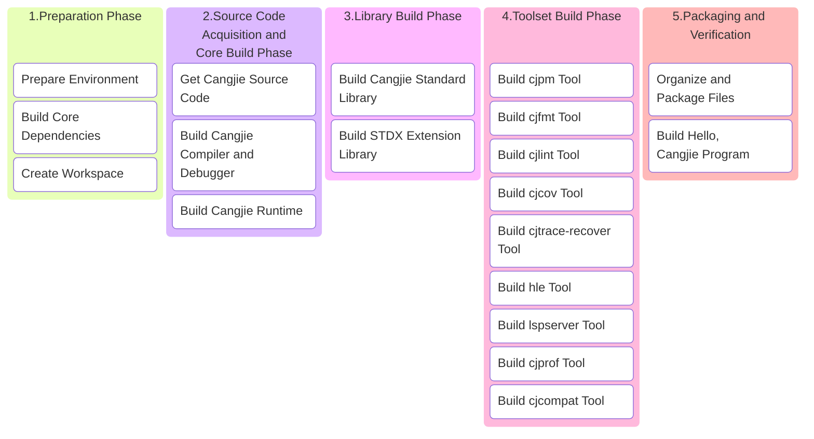

# Cangjie SDK Build Guide

## 1 Build Overview

This guide is designed to help users: set up the Cangjie SDK build environment in Linux systems and build a complete `windows-x64-ohos` Cangjie SDK with all components.

### 1.1 Build Process Overview



### 1.2 Key Notes

1. **Environment Isolation**: All custom dependencies are installed in `/opt/buildtools` to avoid polluting system paths
2. **Memory Requirements**: Full build requires ≥8GB memory, recommend adding 4GB swap space
3. **Network Requirements**: First build requires downloading approximately 3GB of data, please ensure stable network connection
4. **Windows Toolchain Support**: Need to compile LLVM-MinGW-w64 and supporting toolchain
5. **CPU Architecture**: x86_64

## 2 Environment Preparation

### 2.1 System Requirements

- **Operating System**: Ubuntu 22.04 LTS as an example, other versions can also refer to this process
- **Disk Space**: ≥50GB
- **Memory**: ≥8GB (physical memory + swap space)
- **User Permissions**: Regular user + sudo privileges


> You can choose to build Cangjie SDK based on our provided Docker environment. This docker is Ubuntu 18.04 with all system tools and build tools required for building Cangjie pre-installed:
>
> ```bash
> docker pull swr.cn-north-4.myhuaweicloud.com/cj-docker/cangjie_ubuntu18_x86_kernel:v2.9
> ```

### 2.2 System Tools Installation

- Using Huawei Mirror Source (Optional)

  ```bash
  # 1. Backup configuration file:
  sudo cp -a /etc/apt/sources.list /etc/apt/sources.list.bak;
  # 2. Modify sources.list file, replace http://archive.ubuntu.com and http://security.ubuntu.com with http://mirrors.huaweicloud.com, you can refer to the following command:
  sudo sed -i "s@http://.*archive.ubuntu.com@http://mirrors.huaweicloud.com@g" /etc/apt/sources.list;
  sudo sed -i "s@http://.*security.ubuntu.com@http://mirrors.huaweicloud.com@g" /etc/apt/sources.list;
  # 3. Update index
  sudo apt-get update;
  ```

- Install System Tools

  ```bash
  sudo apt update && sudo apt install -y \
    tar unzip wget curl libcurl4 expat openssl make gcc g++ gettext \
    nfs-common libtool sqlite3 zlib1g-dev libssl-dev cmake ninja-build\
    libcurl4-openssl-dev sudo autoconf build-essential rapidjson-dev \
    texinfo binutils expat libelf-dev libdwarf-dev openssh-client ssh \
    dos2unix libxext-dev libxtst-dev libxt-dev libcups2-dev clang clang-15 libedit-dev\
    libxrender-dev zip bzip2 libopenmpi-dev vim gdb lldb libclang-15-dev libgtest-dev\
    rpm patch libtinfo5 cpio rpm2cpio libncurses5 libncurses5-dev strace net-tools;
  ```

### 2.3 Build MinGW-w64 and Supporting Toolchain 

```bash
# Create working directory
export BUILD_ROOT=/opt/buildtools;
sudo mkdir -p $BUILD_ROOT;
sudo chown $USER:$USER $BUILD_ROOT;
export INSTALL_PATH=${BUILD_ROOT}/llvm-mingw-w64
export tmp_cpus=$(grep -w processor /proc/cpuinfo|wc -l);

cd $BUILD_ROOT;

# install mingw llvm toolchain
wget https://github.com/mstorsjo/llvm-mingw/archive/refs/tags/20220906.tar.gz -q --no-check-certificate;
tar xf 20220906.tar.gz;
cd llvm-mingw-20220906
git init llvm-project && cd llvm-project;
git remote add origin https://gitcode.com/openharmony/third_party_llvm-project.git;
git fetch --depth 1 origin 5c68a1cb123161b54b72ce90e7975d95a8eaf2a4 && git checkout FETCH_HEAD;
cd .. && git clone https://gitcode.com/openharmony/third_party_mingw-w64.git mingw-w64;
export TOOLCHAIN_ARCHS=x86_64
./build-llvm.sh ${INSTALL_PATH} --disable-lldb
./strip-llvm.sh ${INSTALL_PATH}
./install-wrappers.sh ${INSTALL_PATH}
./build-mingw-w64.sh ${INSTALL_PATH} --with-default-msvcrt=msvcrt
./build-mingw-w64-tools.sh ${INSTALL_PATH}
./build-compiler-rt.sh ${INSTALL_PATH}
./build-libcxx.sh ${INSTALL_PATH}
./build-mingw-w64-libraries.sh ${INSTALL_PATH}
cp ${INSTALL_PATH}/x86_64-w64-mingw32/lib/libmingwex.a ${INSTALL_PATH}/x86_64-w64-mingw32/lib/libssp.a
cp ${INSTALL_PATH}/x86_64-w64-mingw32/lib/libmingwex.a ${INSTALL_PATH}/x86_64-w64-mingw32/lib/libssp_nonshared.a

# build openssl
wget https://github.com/openssl/openssl/archive/refs/tags/openssl-3.0.9.tar.gz -q --no-check-certificate;
tar xf openssl-3.0.9.tar.gz;
cd "$BUILD_ROOT/openssl-openssl-3.0.9";
mkdir build;
cd build;
../Configure mingw64 --prefix="${INSTALL_PATH}/x86_64-w64-mingw32" --cross-compile-prefix=${INSTALL_PATH}/bin/x86_64-w64-mingw32- --libdir=lib;
make -j $tmp_cpus > build.log;
make install > install.log;
```

### 2.4. Build ohos-x86_64, ohos-aarch64 Toolchain

[Please refer to Building ohos-x86_64, ohos-aarch64 Toolchain](linux_ohos_toolchain.md)

```bash
export OHOS_ROOT=/opt/buildtools/ohos_root;
```

If you are using the official image, you can use the following settings

```bash
export OHOS_ROOT=/opt/buildtools/ohos/ohos_root;
```

### 2.5 Install Python-MinGW

Cross-compiling cjdb for windows-x64 requires Python-MinGW

```bash
INSTALL_PATH=/opt/buildtools/windows
mkdir -p ${INSTALL_PATH}
wget https://mirrors.huaweicloud.com/python/3.11.4/python-3.11.4-embed-amd64.zip --no-check-certificate
wget https://repo.huaweicloud.com/harmonyos/compiler/python/3.11.4/windows/python-mingw-x86-3.11.4_20250617.tar.gz --no-check-certificate
cp -r python-3.11.4-embed-amd64.zip ${INSTALL_PATH}
cp -r python-mingw-x86-3.11.4_20250617.tar.gz ${INSTALL_PATH}
cd ${INSTALL_PATH}
tar -zxf ${INSTALL_PATH}/python-mingw-x86-3.11.4_20250617.tar.gz
mv ${INSTALL_PATH}/windows-x86/3.11.4 ${INSTALL_PATH}/windows-x86/python-3.11.4
unzip ${INSTALL_PATH}/python-3.11.4-embed-amd64.zip -d ${INSTALL_PATH}/windows-x86/python-3.11.4
```

### 2.6 Set Environment Variables

#### (1) OpenSSL Environment Variable Setup

Building Cangjie standard library and Stdx extension library depends on OpenSSL 3+. In the previous section (2.2 System Tools Installation - Install System Tools), we have already installed the OpenSSL library. Now we need to set the `OPENSSL_PATH` environment variable:

 - Locate OpenSSL lib directory

   Library file location: Default in `/usr/lib/x86_64-linux-gnu/` (x86_64), verification method:

   ```bash
   # Find libssl.so
   ls /usr/lib/x86_64-linux-gnu/libssl.so*
   # Find libcrypto.so
   ls /usr/lib/x86_64-linux-gnu/libcrypto.so*
   ```

 - Set OPENSSL_PATH environment variable

   **<font color="red">\* Replace `/path/to/openssl-3.x` in the example below with your `openssl` lib directory</font>**

   ```bash
   export OPENSSL_PATH=/path/to/openssl-3.x
   export LD_LIBRARY_PATH=$OPENSSL_PATH:$LD_LIBRARY_PATH
   ```

- If you are using the official image, you can use the following settings

  ```bash
  # x86_64
  export OPENSSL_PATH=${BUILD_ROOT}/openssl-3.0.9/lib64;
  ```

#### (2) Other Environment Variable Setup

Before proceeding with subsequent steps, configure the following environment variables:

```bash
export MINGW_PATH=${BUILD_ROOT}/llvm-mingw-w64 # MinGW environment variable configuration
export PATH=${MINGW_PATH}/bin:/usr/lib/llvm-15/bin:$PATH; # Add MinGW and clang-15 to environment variables
export TARGET_PYTHON_PATH=/opt/buildtools/windows/windows-x86/python-3.11.4 # Set Python dependency location required by cjdb
export CANGJIE_VERSION=1.0.0 # Cangjie SDK version number
export STDX_VERSION=1 # Stdx version number
```

## 3 Source Code Preparation

### 3.1 Create Workspace

**<font color="red">\* Replace `/path/to/workspace` in the example below with your workspace directory for building Cangjie SDK</font>**

```bash
export WORKSPACE=/path/to/workspace
mkdir -p $WORKSPACE;
cd $WORKSPACE;
```

### 3.2 Get Cangjie Source Code

```bash
git clone https://gitcode.com/Cangjie/cangjie_compiler.git -b main;
git clone https://gitcode.com/Cangjie/cangjie_runtime.git -b main;
git clone https://gitcode.com/Cangjie/cangjie_tools.git -b main;
git clone https://gitcode.com/Cangjie/cangjie_stdx.git -b main;
```

## 4 Build Process

### 4.1 Build Cangjie Compiler and Debugger

```bash
# Build linux x64 compiler
cd ${WORKSPACE}/cangjie_compiler;
python3 build.py clean;
python3 build.py build -t release --no-tests -v ${CANGJIE_VERSION};

# Build windows compiler + cjdb
export CMAKE_PREFIX_PATH=${MINGW_PATH}/x86_64-w64-mingw32;
python3 build.py build -t release \
  --product cjc \
  -v ${CANGJIE_VERSION} \
  --no-tests \
  --target windows-x86_64 \
  --target-sysroot ${MINGW_PATH}/ \
  --target-toolchain ${MINGW_PATH}/bin \
  --build-cjdb;
python3 build.py build -t release \
  --product libs \
  --target windows-x86_64 \
  --target-sysroot ${MINGW_PATH}/ \
  --target-toolchain ${MINGW_PATH}/bin;
python3 build.py build -t release \
  --product libs \
  --target ohos-x86_64  \
  --target-toolchain ${OHOS_ROOT}/prebuilts/clang/ohos/linux-${ARCH}/llvm/bin \
  --target-sysroot ${OHOS_ROOT}/out/sdk/obj/third_party/musl/sysroot;
python3 build.py build -t release \
  --product libs \
  --target ohos-aarch64  \
  --target-toolchain ${OHOS_ROOT}/prebuilts/clang/ohos/linux-${ARCH}/llvm/bin \
  --target-sysroot ${OHOS_ROOT}/out/sdk/obj/third_party/musl/sysroot;

python3 build.py install;
python3 build.py install --host windows-x86_64;
python3 build.py install --host ohos-x86_64;
python3 build.py install --host ohos-aarch64;
cp -rf output-x86_64-linux-ohos/*  output-x86_64-w64-mingw32;
cp -rf output-aarch64-linux-ohos/* output-x86_64-w64-mingw32;
cp -rf output-x86_64-w64-mingw32/* output;
```

Verify installation:
```bash
source output/envsetup.sh;
cjc -v;
```

### 4.2 Build Cangjie Runtime

```bash
cd ${WORKSPACE}/cangjie_runtime/runtime;

# Build runtime
python3 build.py clean;
python3 build.py build -t release -v ${CANGJIE_VERSION};
python3 build.py install;
python3 build.py build -t release \
  --target windows-x86_64 \
  --target-toolchain ${MINGW_PATH}/bin \
  -v ${CANGJIE_VERSION};
python3 build.py install;
python3 build.py build -t release \
  --target ohos-x86_64 \
  --target-toolchain ${OHOS_ROOT} \
  -v ${cangjie_version};
python3 build.py install;
python3 build.py build -t release \
  --target ohos-aarch64 \
  --target-toolchain ${OHOS_ROOT} \
  -v ${cangjie_version};
python3 build.py install;
cp -R output/common/linux_release_x86_64/{lib,runtime}       ${WORKSPACE}/cangjie_compiler/output;
cp -R output/common/windows_release_x86_64/{lib,runtime}     ${WORKSPACE}/cangjie_compiler/output;
cp -R output/common/linux_ohos_release_x86_64/{lib,runtime}  ${WORKSPACE}/cangjie_compiler/output;
cp -R output/common/linux_ohos_release_aarch64/{lib,runtime} ${WORKSPACE}/cangjie_compiler/output;
cp -R output/common/windows_release_x86_64/{lib,runtime}     ${WORKSPACE}/cangjie_compiler/output-x86_64-w64-mingw32;
cp -R output/common/linux_ohos_release_x86_64/{lib,runtime}  ${WORKSPACE}/cangjie_compiler/output-x86_64-w64-mingw32;
cp -R output/common/linux_ohos_release_aarch64/{lib,runtime} ${WORKSPACE}/cangjie_compiler/output-x86_64-w64-mingw32;
```

### 4.3 Build Cangjie Standard Library

```bash
cd ${WORKSPACE}/cangjie_runtime/stdlib;

# Build stdlib
python3 build.py clean;
python3 build.py build -t release \
  --target-lib=$WORKSPACE/cangjie_runtime/runtime/output \
  --target-lib=$OPENSSL_PATH;
python3 build.py build -t release \
  --target windows-x86_64 \
  --target-lib=${WORKSPACE}/cangjie_runtime/runtime/output \
  --target-lib=${MINGW_PATH}/x86_64-w64-mingw32/lib \
  --target-sysroot ${MINGW_PATH}/ \
  --target-toolchain ${MINGW_PATH}/bin;
python3 build.py build -t release \
  --target ohos-x86_64 \
  --target-lib=${WORKSPACE}/cangjie_runtime/runtime/output \
  --target-toolchain ${OHOS_ROOT}/prebuilts/clang/ohos/linux-${ARCH}/llvm/bin \
  --target-sysroot ${OHOS_ROOT}/out/sdk/obj/third_party/musl/sysroot;
python3 build.py build -t release \
  --target ohos-aarch64 \
  --target-lib=${WORKSPACE}/cangjie_runtime/runtime/output \
  --target-toolchain ${OHOS_ROOT}/prebuilts/clang/ohos/linux-${ARCH}/llvm/bin \
  --target-sysroot ${OHOS_ROOT}/out/sdk/obj/third_party/musl/sysroot;
python3 build.py install;
cp -rf output/* ${WORKSPACE}/cangjie_compiler/output/;
cp -rf output/* ${WORKSPACE}/cangjie_compiler/output-x86_64-w64-mingw32/;
```

### 4.4 Build Stdx Extension Library

```bash
cd ${WORKSPACE}/cangjie_stdx;
python3 build.py clean;
python3 build.py build -t release \
  --target-lib=${MINGW_PATH}/x86_64-w64-mingw32/lib \
  --target windows-x86_64 \
  --target-sysroot ${MINGW_PATH}/ \
  --target-toolchain ${MINGW_PATH}/bin \
  --include=${WORKSPACE}/cangjie_compiler/include;
python3 build.py install;
export CANGJIE_STDX_PATH=${WORKSPACE}/cangjie_stdx/target/windows_x86_64_cjnative/static/stdx;
```

### 4.5 Build Toolset

#### (1) cjpm

```bash
cd ${WORKSPACE}/cangjie_tools/cjpm/build;
python3 build.py clean;
python3 build.py build -t release --target windows-x86_64;
python3 build.py install;
mkdir -p cangjie/tools/config;
cp $WORKSPACE/cangjie_tools/cjpm/dist/cjpm.exe ${WORKSPACE}/cangjie_compiler/output-x86_64-w64-mingw32/tools/bin;
mv $WORKSPACE/cangjie_tools/cjpm/dist/*.toml   ${WORKSPACE}/cangjie_compiler/output-x86_64-w64-mingw32/tools/config;
```

#### (2) cjfmt

```bash
cd ${WORKSPACE}/cangjie_tools/cjfmt/build;
python3 build.py clean;
python3 build.py build -t release --target windows-x86_64;
python3 build.py install;
cp $WORKSPACE/cangjie_tools/cjfmt/dist/bin/cjfmt.exe ${WORKSPACE}/cangjie_compiler/output-x86_64-w64-mingw32/tools/bin;
cp $WORKSPACE/cangjie_tools/cjfmt/config/*.toml      ${WORKSPACE}/cangjie_compiler/output-x86_64-w64-mingw32/tools/config;
```

#### (3) cjlint

```bash
cd ${WORKSPACE}/cangjie_tools/cjlint/build;
python3 build.py clean;
python3 build.py build -t release --target windows-x86_64;
python3 build.py install;
cp $WORKSPACE/cangjie_tools/cjlint/dist/bin/cjlint.exe ${WORKSPACE}/cangjie_compiler/output-x86_64-w64-mingw32/tools/bin;
cp $WORKSPACE/cangjie_tools/cjlint/dist/lib/*          ${WORKSPACE}/cangjie_compiler/output-x86_64-w64-mingw32/tools/lib;
cp $WORKSPACE/cangjie_tools/cjlint/dist/config/*       ${WORKSPACE}/cangjie_compiler/output-x86_64-w64-mingw32/tools/config;
```

#### (4) cjcov

```bash
cd ${WORKSPACE}/cangjie_tools/cjcov/build;
python3 build.py clean;
python3 build.py build -t release --target windows-x86_64;
python3 build.py install;
cp $WORKSPACE/cangjie_tools/cjcov/dist/cjcov.exe ${WORKSPACE}/cangjie_compiler/output-x86_64-w64-mingw32/tools/bin;
```

#### (5) cjtrace-recover

```bash
cd ${WORKSPACE}/cangjie_tools/cjtrace-recover/build;
python3 build.py clean;
python3 build.py build -t release --target windows-x86_64 --target-sysroot ${MINGW_PATH};
python3 build.py install --prefix ${WORKSPACE}/cangjie_compiler/output-x86_64-w64-mingw32/tools;
```

#### (6) HyperLangExtension

```bash
cd ${WORKSPACE}/cangjie_tools/hyperlangExtension/build;
python3 build.py clean;
python3 build.py build -t release --target windows-x86_64;
python3 build.py install;
cp $WORKSPACE/cangjie_tools/hyperlangExtension/target/bin/main.exe ${WORKSPACE}/cangjie_compiler/output-x86_64-w64-mingw32/tools/bin/hle.exe;
cp -r $WORKSPACE/cangjie_tools/hyperlangExtension/src/dtsparser ${WORKSPACE}/cangjie_compiler/output-x86_64-w64-mingw32/tools;
rm -rf ${WORKSPACE}/cangjie_compiler/output-x86_64-w64-mingw32/tools/dtsparser/*.cj;
```

#### (7) LSP Server

```bash
cd ${WORKSPACE}/cangjie_tools/cangjie-language-server/build;
python3 build.py clean;
python3 build.py build -t release --target windows-x86_64;
python3 build.py install;
cp $WORKSPACE/cangjie_tools/cangjie-language-server/output/bin/LSPServer.exe ${WORKSPACE}/cangjie_compiler/output-x86_64-w64-mingw32/tools/bin;
```

#### (8) cjprof

```bash
cd ${WORKSPACE}/cangjie_tools/cjprof/build;
python3 build.py build -t release --target windows-x86_64;
python3 build.py install;
cp $WORKSPACE/cangjie_tools/cjprof/dist/bin/cjprof.exe ${WORKSPACE}/cangjie_compiler/output-x86_64-w64-mingw32/tools/bin;
cp $WORKSPACE/cangjie_tools/cjprof/dist/lib/* ${WORKSPACE}/cangjie_compiler/output-x86_64-w64-mingw32/tools/lib;
if [[ -d "$WORKSPACE/cangjie_tools/cjprof/static" ]]; then
  cp -Rf $WORKSPACE/cangjie_tools/cjprof/static cangjie/tools/config;
fi
```

#### (9) cjcompat

```bash
cd ${WORKSPACE}/cangjie_tools/cjcompat/build;
python3 build.py build -t release;
python3 build.py install;
cp $WORKSPACE/cangjie_tools/cjcompat/dist/bin/cjcompat.exe ${WORKSPACE}/cangjie_compiler/output-x86_64-w64-mingw32/tools/bin
```

## 5 Package and Release

### 5.1 Organize Files

```bash
# Clear previous builds
mkdir -p $WORKSPACE/software;
rm -rf $WORKSPACE/software/*;
cd $WORKSPACE/software;

# Copy cangjie directory
cp -R $WORKSPACE/cangjie_compiler/output-x86_64-w64-mingw32 cangjie;
cp $WORKSPACE/cangjie_compiler/LICENSE cangjie;
cp $WORKSPACE/cangjie_compiler/Open_Source_Software_Notice.docx cangjie;

# Package and set permissions
chmod -R 750 cangjie
zip -qr cangjie-sdk-windows-x64-ohos-${CANGJIE_VERSION}.zip cangjie;
chmod 550 cangjie-sdk-windows-x64-ohos-${CANGJIE_VERSION}.zip;
```

### 5.2 Organize and Package Stdx

```bash
cd $WORKSPACE/software;
# Copy stdx directory
cp -r $WORKSPACE/cangjie_stdx/target/windows_x86_64_cjnative ./;
cp $WORKSPACE/cangjie_stdx/LICENSE windows_x86_64_cjnative;
cp $WORKSPACE/cangjie_stdx/Open_Source_Software_Notice.docx windows_x86_64_cjnative;
chmod -R 750 windows_x86_64_cjnative;
zip -qr cangjie-stdx-windows-x64-${CANGJIE_VERSION}.${STDX_VERSION}.zip windows_x86_64_cjnative;
chmod 550 cangjie-stdx-windows-x64-${CANGJIE_VERSION}.${STDX_VERSION}.zip;
```

## 6 Build Hello, Cangjie Program

Check generated files:

```bash
ls -lh $WORKSPACE/software
# Should include:
# - cangjie-sdk-windows-x64-ohos-${CANGJIE_VERSION}.zip
# - cangjie-stdx-windows-x64-${CANGJIE_VERSION}.${STDX_VERSION}.zip
```

Verify hello cangjie program (please execute the following commands on Windows):

1. Install Cangjie SDK

   - If using Windows Command Prompt (CMD) environment, execute:

     ```bash
     path\to\cangjie\envsetup.bat
     ```

   - If using PowerShell environment, execute:

     ```bash
     . path\to\cangjie\envsetup.ps1
     ```

   - If using MSYS shell, bash, etc., execute:

     ```bash
     source path/to/cangjie/envsetup.sh
     ```

2. Create and run cj file:

   ```bash
   echo "main() { println(\"Hello, Cangjie\") }" > hello.cj
   # HarmonyOS PC/Phone
   cjc hello.cj --target=aarch64-linux-ohos -B${OHOS_ROOT}/out/sdk/obj/third_party/musl/sysroot/usr/lib/aarch64-linux-ohos -L${OHOS_ROOT}/out/sdk/obj/third_party/musl/sysroot/usr/lib/aarch64-linux-ohos
   # Emulator
   cjc hello.cj --target=x86_64-linux-ohos -B${OHOS_ROOT}/out/sdk/obj/third_party/musl/sysroot/usr/lib/x86_64-linux-ohos -L${OHOS_ROOT}/out/sdk/obj/third_party/musl/sysroot/usr/lib/x86_64-linux-ohos
   # Should print:
   # Hello, Cangjie
   ```

🎉 Congratulations on successfully building the Cangjie SDK and running the Hello, Cangjie program!

