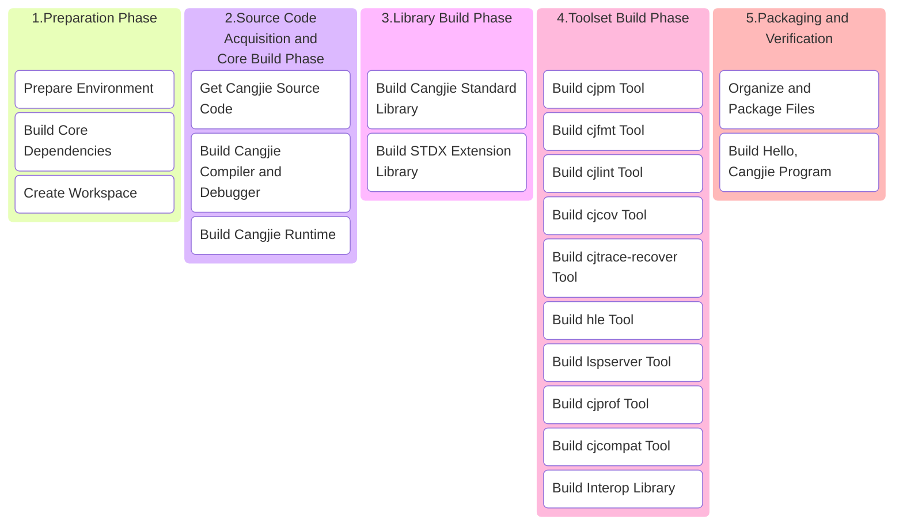

# Cangjie SDK Build Guide

## 1 Build Overview

This guide is designed to help users: set up the Cangjie SDK build environment in macOS systems and build a complete `mac-android` Cangjie SDK with all components.

### Build Process Overview



## 2 Environment Preparation

### 2.1 System Requirements

- **Operating System**: macOS 14 Sonoma as an example, other versions can also refer to this process
- **Disk Space**: ≥50GB
- **Memory**: ≥8GB (physical memory + swap space)
- **User Permissions**: Regular user + sudo privileges
- **Android NDK Toolchain**: This guide uses Android NDK r26d as an example, supports Android 26+
- **CPU Architecture**: **Must** set corresponding environment variables based on your computer's chip architecture (x86_64 or aarch64)

### 2.2 System Tools Installation

It is recommended to use `Homebrew` to install dependencies required for building Cangjie:

 - [Homebrew Official Website](https://brew.sh/zh-cn/)
 - [Homebrew China Mirror](https://developer.aliyun.com/mirror/homebrew/)

#### (1) Install Required Dependencies

**1. cmake (requires >=3.17, <4)**

Download dmg or tar.gz package from [CMake Official Website](https://cmake.org/download/#previous) and install manually:

- Using dmg installation: After downloading, drag into Applications, and execute:

  **<font color="red">\* Replace `/path/to/cmake` in the example below with your custom installation directory</font>**

  ```bash
  # Choose one of the following commands:
  # Install to /usr/local/bin
  sudo "/Applications/CMake.app/Contents/bin/cmake-gui" --install
  # Custom installation location
  sudo "/Applications/CMake.app/Contents/bin/cmake-gui" --install=/path/to/cmake
  
  # Add cmake/bin to environment variables before use
  PATH="/Applications/CMake.app/Contents/bin:$PATH"
  ```

- Using tar.gz: 

  ```bash
  # Extract tar package
  tar -zxvf cmake-3.x.x-macos-universal.tar.gz /path/to/cmake
  # Add cmake/bin to environment variables before use or add configuration to ~/.zshrc
  export PATH="/path/to/cmake/bin:$PATH"
  ```

#### (2) Other Essential Build Tools

```bash
brew install python3 ninja llvm@16 openssl@3 bison googletest gnu-tar swig
```

### 2.3 Install Android NDK r26d

```bash
export BUILD_ROOT=/opt/buildtools;
sudo mkdir -p ${BUILD_ROOT}/Android-NDK-r26d/
cd ${BUILD_ROOT};
curl -O https://dl.google.com/android/repository/android-ndk-r26d-darwin.dmg;
hdiutil attach android-ndk-r26d-darwin.dmg -mountpoint /Volumes/android-ndk-r26d;
sudo cp -R /Volumes/android-ndk-r26d/AndroidNDK11579264.app ${BUILD_ROOT}/Android-NDK-r26d/;
hdiutil detach /Volumes/android-ndk-r26d;
```

### 2.4 Set Environment Variables

***Please set the following variables before building:***

```bash
export ARCH=aarch64 # or x86_64
export CANGJIE_VERSION=1.0.0 # Cangjie SDK version
export STDX_VERSION=1 # Stdx version
export SDK_NAME=mac-aarch64 # or mac-x64
export ANDROID_NDK_ROOT=${BUILD_ROOT}/Android-NDK-r26d/AndroidNDK11579264.app/Contents/NDK/ # Android NDK
export ANDROID_TOOLCHAIN=${ANDROID_NDK_ROOT}/toolchains/llvm/prebuilt/darwin-arm64/bin # or darwin-x86_64
```

**<font color="red">\* Note: Please replace the build tool versions below according to the specific versions you have installed</font>**

**<font color="red">\* Replace version numbers like 16.x, 1.x, 3.x in the example below with the specific version numbers you have installed</font>**

```bash
export CELLAR_PATH=/path/to/Cellar
# Can use brew --cellar command to check
# For arm chips, Cellar is usually located at: /opt/homebrew/Cellar
# For intel chips, Cellar is usually located at: /usr/local/Cellar

# How to find version numbers:
# Use `brew list --versions` to view installed packages and their version numbers, for example:
# brew list --versions llvm@16
export PATH=$CELLAR_PATH/llvm@16/16.x/bin:$PATH
export OPENSSL_PATH=$CELLAR_PATH/openssl@3/3.x/lib
export LD_LIBRARY_PATH=$OPENSSL_PATH:$LD_LIBRARY_PATH
export DYLD_LIBRARY_PATH=$OPENSSL_PATH:$DYLD_LIBRARY_PATH
```

## 3 Source Code Preparation

### 3.1 Create Workspace

**<font color="red">\* Replace `/path/to/workspace` in the example below with your workspace directory for building Cangjie SDK</font>**

```bash
export WORKSPACE=/path/to/workspace
mkdir -p $WORKSPACE;
cd $WORKSPACE;
```

### 3.2 Get Cangjie Source Code

```bash
git clone https://gitcode.com/Cangjie/cangjie_compiler.git -b main;
git clone https://gitcode.com/Cangjie/cangjie_runtime.git -b main;
git clone https://gitcode.com/Cangjie/cangjie_tools.git -b main;
git clone https://gitcode.com/Cangjie/cangjie_stdx.git -b main;
git clone https://gitcode.com/Cangjie/cangjie_multiplatform_interop.git -b main;
```

## 4 Build Process

### 4.1 Build Cangjie Compiler and Debugger

Execute build:
```bash
cd $WORKSPACE/cangjie_compiler;
python3 build.py clean;
python3 build.py build -t release -v ${CANGJIE_VERSION} --no-tests --build-cjdb;
python3 build.py build -t release --target android26-aarch64 --android-ndk ${ANDROID_NDK_ROOT};
python3 build.py install;
```

Verify installation:
```bash
source output/envsetup.sh;
cjc -v;
```

### 4.2 Build Cangjie Runtime

```bash
cd $WORKSPACE/cangjie_runtime/runtime;
python3 build.py clean;
python3 build.py build -t release -v ${CANGJIE_VERSION};
python3 build.py install;
python3 build.py build -t release \
  -v ${CANGJIE_VERSION} \
  --target android26-aarch64 \
  --target-toolchain ${ANDROID_NDK_ROOT}/toolchains;
python3 build.py install;
cp -R output/common/darwin_release_${ARCH}/{lib,runtime}        ${WORKSPACE}/cangjie_compiler/output;
cp -R output/common/linux_android_release_aarch64/{lib,runtime} ${WORKSPACE}/cangjie_compiler/output;
```

### 4.3 Build Cangjie Standard Library

```bash
cd $WORKSPACE/cangjie_runtime/stdlib;
python3 build.py clean;
python3 build.py build -t release \
  --target-lib=$WORKSPACE/cangjie_runtime/runtime/output \
  --target-lib=$OPENSSL_PATH;
python3 build.py build -t release \
  --target-lib=${WORKSPACE}/cangjie_runtime/runtime/output \
  --target android26-aarch64 \
  --include=$OPENSSL_PATH/../include \
  --target-toolchain ${ANDROID_TOOLCHAIN};

python3 build.py install;
cp -R output/* $WORKSPACE/cangjie_compiler/output/;
```

### 4.4 Build Stdx Extension Library

```bash
cd $WORKSPACE/cangjie_stdx;
python3 build.py clean;
python3 build.py build -t release --target-lib=$OPENSSL_PATH --include=${WORKSPACE}/cangjie_compiler/include;
python3 build.py build -t release \
  --target android26-aarch64 \
  --include=/opt/buildtools/openssl-3.0.9/include \
  --target-toolchain ${ANDROID_TOOLCHAIN};
python3 build.py install;
export CANGJIE_STDX_PATH=$WORKSPACE/cangjie_stdx/target/darwin_${ARCH}_cjnative/static/stdx;
```

### 4.5 Build Cangjie Toolset

#### (1) cjpm

```bash
cd $WORKSPACE/cangjie_tools/cjpm/build;
python3 build.py clean;
python3 build.py build -t release --set-rpath @loader_path/../../runtime/lib/darwin_${ARCH}_cjnative;
python3 build.py install;
mkdir -p ${WORKSPACE}/cangjie_compiler/output/tools/config;
cp ${WORKSPACE}/cangjie_tools/cjpm/dist/cjpm   ${WORKSPACE}/cangjie_compiler/output/tools/bin;
mv ${WORKSPACE}/cangjie_tools/cjpm/dist/*.toml ${WORKSPACE}/cangjie_compiler/output/tools/config;
```

#### (2) cjfmt

```bash
cd ${WORKSPACE}/cangjie_tools/cjfmt/build;
python3 build.py clean;
python3 build.py build -t release;
python3 build.py install;
mv ${WORKSPACE}/cangjie_tools/cjfmt/build/build/bin/cjfmt ${WORKSPACE}/cangjie_compiler/output/tools/bin;
mv ${WORKSPACE}/cangjie_tools/cjfmt/config/*.toml         ${WORKSPACE}/cangjie_compiler/output/tools/config;
```

#### (3) cjlint

```bash
cd ${WORKSPACE}/cangjie_tools/cjlint/build;
python3 build.py clean;
python3 build.py build -t release;
python3 build.py install;
mv ${WORKSPACE}/cangjie_tools/cjlint/dist/bin/cjlint ${WORKSPACE}/cangjie_compiler/output/tools/bin
mv ${WORKSPACE}/cangjie_tools/cjlint/dist/lib/*      ${WORKSPACE}/cangjie_compiler/output/tools/lib
mv ${WORKSPACE}/cangjie_tools/cjlint/dist/config/*   ${WORKSPACE}/cangjie_compiler/output/tools/config
```

#### (4) cjcov

```bash
cd ${WORKSPACE}/cangjie_tools/cjcov/build;
python3 build.py clean;
python3 build.py build -t release;
python3 build.py install;
mv ${WORKSPACE}/cangjie_tools/cjcov/dist/cjcov ${WORKSPACE}/cangjie_compiler/output/tools/bin;
```

#### (5) cjtrace-recover

```bash
cd ${WORKSPACE}/cangjie_tools/cjtrace-recover/build;
python3 build.py clean;
python3 build.py build -t release;
python3 build.py install --prefix ${WORKSPACE}/cangjie_compiler/output/tools;
```

#### (6) HyperLangExtension

```bash
cd $WORKSPACE/cangjie_tools/hyperlangExtension/build;
python3 build.py clean;
python3 build.py build -t release;
python3 build.py install;
cp ${WORKSPACE}/cangjie_tools/hyperlangExtension/target/bin/main  ${WORKSPACE}/cangjie_compiler/output/tools/bin/hle;
cp -R ${WORKSPACE}/cangjie_tools/hyperlangExtension/src/dtsparser ${WORKSPACE}/cangjie_compiler/output/tools;
rm -rf ${WORKSPACE}/cangjie_compiler/output/tools/dtsparser/*.cj;
```

#### (7) LSP Server

```bash
cd $WORKSPACE/cangjie_tools/cangjie-language-server/build;
python3 build.py clean;
python3 build.py build -t release;
python3 build.py install;
cp ${WORKSPACE}/cangjie_tools/cangjie-language-server/output/bin/LSPServer ${WORKSPACE}/cangjie_compiler/output/tools/bin
```

#### (8) cjprof

```bash
cd ${WORKSPACE}/cangjie_tools/cjprof/build;
python3 build.py build -t release;
python3 build.py install;
cp $WORKSPACE/cangjie_tools/cjprof/dist/bin/cjprof ${WORKSPACE}/cangjie_compiler/output/tools/bin
cp $WORKSPACE/cangjie_tools/cjprof/dist/lib/* ${WORKSPACE}/cangjie_compiler/output/tools/lib;
if [[ -d "$WORKSPACE/cangjie_tools/cjprof/static" ]]; then
  cp -Rf $WORKSPACE/cangjie_tools/cjprof/static cangjie/tools/config;
fi
```

#### (9) cjcompat

```bash
cd ${WORKSPACE}/cangjie_tools/cjcompat/build;
python3 build.py build -t release;
python3 build.py install;
cp $WORKSPACE/cangjie_tools/cjcompat/dist/bin/cjcompat ${WORKSPACE}/cangjie_compiler/output/tools/bin
```

#### (10) Java Interop

```bash
cd ${WORKSPACE}/cangjie_multiplatform_interop/java/build
# java-mirror-gen
python3 build.py clean;
python3 build.py build -t release;
python3 build.py install --prefix ${WORKSPACE}/cangjie_compiler/output;

# interoplib aarch64-linux-android
export PATH=${ANDROID_TOOLCHAIN}:$PATH;
source ${WORKSPACE}/cangjie_compiler/output/envsetup.sh;
python3 build.py clean;
python3 build.py build -t ${build_type} \
  --target aarch64-linux-android26 \
  --target-sysroot ${ANDROID_TOOLCHAIN}/../sysroot \
  --target-toolchain ${ANDROID_TOOLCHAIN} \
  --target-lib linux_android_aarch64_cjnative;
python3 build.py install --target linux_android_aarch64 --prefix ${WORKSPACE}/cangjie_compiler/output;
```

## 5 Organize and Package Files

### 5.1 Organize and Package SDK

```bash
# Clear previous builds
mkdir -p $WORKSPACE/software;
rm -rf $WORKSPACE/software/*;
cd $WORKSPACE/software;

# Copy cangjie directory
cp -R $WORKSPACE/cangjie_compiler/output cangjie;
cp $WORKSPACE/cangjie_compiler/LICENSE cangjie;
cp $WORKSPACE/cangjie_compiler/Open_Source_Software_Notice.docx cangjie;

# Package and set permissions
chmod -R 750 cangjie
gtar --format=gnu -zcvf cangjie-sdk-${SDK_NAME}-${CANGJIE_VERSION}.tar.gz cangjie;
chmod 550 cangjie-sdk-${SDK_NAME}-${CANGJIE_VERSION}.tar.gz;
```

### 5.2 Organize and Package Stdx

```bash
cd $WORKSPACE/software;
# Copy stdx directory
cp -r $WORKSPACE/cangjie_stdx/target/darwin_${ARCH}_cjnative ./;
cp $WORKSPACE/cangjie_stdx/LICENSE darwin_${ARCH}_cjnative;
cp $WORKSPACE/cangjie_stdx/Open_Source_Software_Notice.docx darwin_${ARCH}_cjnative;
chmod -R 750 darwin_${ARCH}_cjnative;
zip -qr cangjie-stdx-${SDK_NAME}-${CANGJIE_VERSION}.${STDX_VERSION}.zip darwin_${ARCH}_cjnative;
chmod 550 cangjie-stdx-${SDK_NAME}-${CANGJIE_VERSION}.${STDX_VERSION}.zip;
```

## 6 Build Hello, Cangjie Program

Check generated files:

```bash
ls -lh $WORKSPACE/software
# Should include:
# - cangjie-sdk-${SDK_NAME}-${CANGJIE_VERSION}.tar.gz
# - cangjie-stdx-${SDK_NAME}-${CANGJIE_VERSION}.${STDX_VERSION}.zip
```

Verify Hello, Cangjie program:

```bash
cd $WORKSPACE;
source $WORKSPACE/software/cangjie/envsetup.sh;
echo "main() { println(\"Hello, Cangjie\") }" > hello.cj
cjc hello.cj -o hello && ./hello
# You will see the following output in the console:
# Hello, Cangjie
```

🎉 Congratulations on successfully building the Cangjie SDK and running the Hello, Cangjie program!

