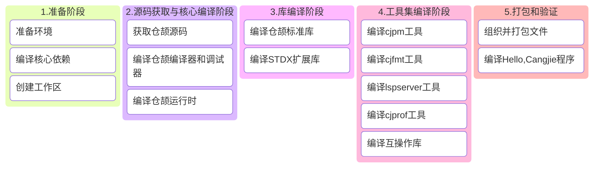

# 仓颉SDK构建指导书

## 1 构建概述

本指导书用于指导用户：在 Linux 系统中搭建 Cangjie SDK 构建环境及集成构建包含全部组件的 `ohos-aarch64` Cangjie SDK。

### 1.1 构建流程全景图



### 1.2 关键注意事项

1. **环境隔离**：所有自定义依赖安装在 `/opt/buildtools`，避免污染系统路径
2. **内存要求**：完整构建需要 ≥8GB 内存，建议添加 4GB 交换空间
3. **网络要求**：首次构建需下载约 3GB 数据，请确保稳定网络连接
4. **芯片指令集**：x86_64

## 2 环境准备

### 2.1 系统要求

- **操作系统**: 以 Ubuntu 22.04 LTS 作为示例，其他版本也可以参考本文流程
- **磁盘空间**: ≥50GB
- **内存**: ≥8GB (物理内存+交换空间)
- **用户权限**: 普通用户 + sudo权限

> 您可以选择基于我们提供的Docker环境进行Cangjie SDK构建，该docker为Ubuntu 18.04，已内置所有构建Cangjie所需的系统工具和构建工具：
>
> ```bash
> docker pull swr.cn-north-4.myhuaweicloud.com/cj-docker/cangjie_ubuntu18_x86_kernel:v2.9
> ```

### 2.2 系统工具安装

- 使用华为镜像源(可选)

  ```bash
  # 1.备份配置文件：
  sudo cp -a /etc/apt/sources.list /etc/apt/sources.list.bak;
  # 2.修改sources.list文件，将http://archive.ubuntu.com和http://security.ubuntu.com替换成http://mirrors.huaweicloud.com，可以参考如下命令：
  sudo sed -i "s@http://.*archive.ubuntu.com@http://mirrors.huaweicloud.com@g" /etc/apt/sources.list;
  sudo sed -i "s@http://.*security.ubuntu.com@http://mirrors.huaweicloud.com@g" /etc/apt/sources.list;
  # 3.更新索引
  sudo apt-get update;
  ```

- 安装系统工具

  ```bash
  sudo apt update && sudo apt install -y \
    tar unzip wget curl libcurl4 expat openssl make gcc g++ gettext \
    nfs-common libtool sqlite3 zlib1g-dev libssl-dev cmake ninja-build\
    libcurl4-openssl-dev sudo autoconf build-essential rapidjson-dev \
    texinfo binutils expat libelf-dev libdwarf-dev openssh-client ssh \
    dos2unix libxext-dev libxtst-dev libxt-dev libcups2-dev clang clang-15 libedit-dev\
    libxrender-dev zip bzip2 libopenmpi-dev vim gdb lldb libclang-15-dev libgtest-dev\
    rpm patch libtinfo5 cpio rpm2cpio libncurses5 libncurses5-dev strace net-tools swig;
  ```

### 2.3. 编译ohos-x86_64、ohos-aarch64工具链

[请参考编译ohos-aarch64工具链](linux_ohos_toolchain.md)

```bash
export OHOS_ROOT=/opt/buildtools/ohos_root;
```

若您正在使用官方镜像，可以使用下方设置

```bash
export OHOS_ROOT=/opt/buildtools/ohos/ohos_root;
```

### 2.4 设置环境变量

#### (1) OpenSSL环境变量设置

构建 Cangjie 标准库依赖 OpenSSL 3+，在前面（2.2 章节中系统工具安装 - 安装系统工具）中，我们已经安装了OpenSSL库，现在我们需要设置`OPENSSL_PATH`环境变量：

 - 定位OpenSSL的lib目录

   库文件位置：默认在 `/usr/lib/x86_64-linux-gnu/`（x86_64），验证方法：

   ```bash
   # 查找libssl.so
   ls /usr/lib/x86_64-linux-gnu/libssl.so*
   # 查找libcrypto.so
   ls /usr/lib/x86_64-linux-gnu/libcrypto.so*
   ```

 - 设置 OPENSSL_PATH 环境变量

   **<font color="red">\* 下方示例的`/path/to/openssl-3.x`需更换为您的 `openssl` lib目录</font>**

   ```bash
   export OPENSSL_PATH=/path/to/openssl-3.x
   export LD_LIBRARY_PATH=$OPENSSL_PATH:$LD_LIBRARY_PATH
   ```

- 若您正在使用官方镜像，可以使用下方设置

  ```bash
  # x86_64
  export OPENSSL_PATH=${BUILD_ROOT}/openssl-3.0.9/lib64;
  ```

#### (2) 其他环境变量设置

在进行后续操作步骤前，需要配置以下环境变量：

```bash
export PATH=/usr/lib/llvm-15/bin:$PATH; # 用于将 clang-15 加入环境变量
# 架构名
export ARCH=x86_64 # 或aarch64
# Cangjie SDK 版本号
export CANGJIE_VERSION=1.0.0
# Stdx版本号
export STDX_VERSION=1
export SDK_NAME=ohos-aarch64
```

## 3. 源码准备

### 3.1 创建工作区

**<font color="red">\* 下方示例的`/path/to/workspace`需更换为您构建Cangjie SDK的工作目录</font>**

```bash
export WORKSPACE=/path/to/workspace
mkdir -p $WORKSPACE;
cd $WORKSPACE;
```

### 3.2 获取Cangjie源码

```bash
git clone https://gitcode.com/Cangjie/cangjie_compiler.git -b main;
git clone https://gitcode.com/Cangjie/cangjie_runtime.git -b main;
git clone https://gitcode.com/Cangjie/cangjie_tools.git -b main;
git clone https://gitcode.com/Cangjie/cangjie_stdx.git -b main;
```

## 4 编译流程

### 4.1 编译仓颉编译器和调试器

> 执行构建：

```bash
cd $WORKSPACE/cangjie_compiler;
python3 build.py clean;
python3 build.py build -t release --no-tests -v ${CANGJIE_VERSION};
python3 build.py build -t release \
  -v ${CANGJIE_VERSION} \
  --product cjc \
  --no-tests \
  --target ohos-aarch64 \
  --target-toolchain ${OHOS_ROOT}/prebuilts/clang/ohos/linux-x86_64/llvm/bin \
  --target-sysroot ${OHOS_ROOT}/out/sdk/obj/third_party/musl/sysroot \
  --build-cjdb;
python3 build.py build -t release \
  --product libs \
  --target ohos-aarch64 \
  --target-toolchain ${OHOS_ROOT}/prebuilts/clang/ohos/linux-x86_64/llvm/bin \
  --target-sysroot ${OHOS_ROOT}/out/sdk/obj/third_party/musl/sysroot;
python3 build.py install;
python3 build.py install --host ohos-aarch64;
cp -Rn output-aarch64-linux-ohos/* output;
```

验证安装：
```bash
source output/envsetup.sh;
cjc -v;
```

### 4.2 编译仓颉运行时

```bash
cd $WORKSPACE/cangjie_runtime/runtime;
python3 build.py clean;
python3 build.py build -t release -v ${CANGJIE_VERSION};
python3 build.py install;
python3 build.py build -t release \
  --target ohos-aarch64 \
  --target-toolchain ${OHOS_ROOT} \
  -v ${CANGJIE_VERSION};
python3 build.py install;
cp -R output/common/linux_release_x86_64/{lib,runtime}       ${WORKSPACE}/cangjie_compiler/output;
cp -R output/common/linux_ohos_release_aarch64/{lib,runtime} ${WORKSPACE}/cangjie_compiler/output;
cp -R output/common/linux_ohos_release_aarch64/{lib,runtime} ${WORKSPACE}/cangjie_compiler/output-aarch64-linux-ohos;
```

### 4.3 编译仓颉标准库

```bash
cd $WORKSPACE/cangjie_runtime/stdlib;
python3 build.py clean;
python3 build.py build -t release \
  --target-lib=$WORKSPACE/cangjie_runtime/runtime/output \
  --target-lib=$OPENSSL_PATH;
python3 build.py build -t release \
  --target ohos-aarch64 \
  --target-lib=${WORKSPACE}/cangjie_runtime/runtime/output \
  --target-toolchain ${OHOS_ROOT}/prebuilts/clang/ohos/linux-x86_64/llvm/bin \
  --target-sysroot ${OHOS_ROOT}/out/sdk/obj/third_party/musl/sysroot;
python3 build.py install;
cp -R output/* ${WORKSPACE}/cangjie_compiler/output/;
cp -R output/* ${WORKSPACE}/cangjie_compiler/output-aarch64-linux-ohos;
```

### 4.4 编译 STDX扩展库

```bash
cd ${WORKSPACE}/cangjie_stdx;
python3 build.py clean;
python3 build.py build -t release \
  --target-lib=${OPENSSL_PATH} \
  --target ohos-aarch64 \
  --target-sysroot ${OHOS_ROOT}/out/sdk/obj/third_party/musl/sysroot \
  --target-toolchain ${OHOS_ROOT}/prebuilts/clang/ohos/linux-x86_64/llvm/bin \
  --include=${WORKSPACE}/cangjie_compiler/include;
python3 build.py install;
export CANGJIE_STDX_PATH=${WORKSPACE}/cangjie_stdx/target/linux_ohos_aarch64_cjnative/static/stdx;
```

### 4.5 编译工具集

#### (1) cjpm

```bash
cd ${WORKSPACE}/cangjie_tools/cjpm/build;
python3 build.py clean;
python3 build.py build -t release --target ohos-aarch64;
python3 build.py install;
mkdir -p ${WORKSPACE}/cangjie_compiler/output-aarch64-linux-ohos/tools/config;
cp $WORKSPACE/cangjie_tools/cjpm/dist/cjpm   ${WORKSPACE}/cangjie_compiler/output-aarch64-linux-ohos/tools/bin;
mv $WORKSPACE/cangjie_tools/cjpm/dist/*.toml ${WORKSPACE}/cangjie_compiler/output-aarch64-linux-ohos/tools/config;
```

#### (2) cjfmt

```bash
source ${WORKSPACE}/cangjie_compiler/output-aarch64-linux-ohos/envsetup.sh;
export PATH=${OHOS_ROOT}/prebuilts/clang/ohos/linux-x86_64/llvm/bin:$PATH; # 将 ohos 工具链加入环境变量
cd ${WORKSPACE}/cangjie_tools/cjfmt/build;
python3 build.py clean;
python3 build.py build -t release --target ohos-aarch64 --target-sysroot ${OHOS_ROOT}/out/sdk/obj/third_party/musl/sysroot;
python3 build.py install;
cp $WORKSPACE/cangjie_tools/cjfmt/build/build/bin/cjfmt ${WORKSPACE}/cangjie_compiler/output-aarch64-linux-ohos/tools/bin;
cp $WORKSPACE/cangjie_tools/cjfmt/config/*.toml         ${WORKSPACE}/cangjie_compiler/output-aarch64-linux-ohos/tools/config;
```

#### (3) cjprof

```bash
cd ${WORKSPACE}/cangjie_tools/cjprof/build;
python3 build.py build -t release;
python3 build.py install;
cp $WORKSPACE/cangjie_tools/cjprof/dist/bin/cjprof ${WORKSPACE}/cangjie_compiler/output/tools/bin
cp $WORKSPACE/cangjie_tools/cjprof/dist/lib/* ${WORKSPACE}/cangjie_compiler/output/tools/lib;
```

## 5 组织并打包文件

### 5.1 组织并打包 SDK

```bash
# 清空历史构建
mkdir -p $WORKSPACE/software;
rm -rf $WORKSPACE/software/*;
cd $WORKSPACE/software;

# 拷贝cangjie目录
cp -R $WORKSPACE/cangjie_compiler/output-aarch64-linux-ohos cangjie;
cp $WORKSPACE/cangjie_compiler/LICENSE cangjie;
cp $WORKSPACE/cangjie_compiler/Open_Source_Software_Notice.docx cangjie;

# 打包和设置权限
chmod -R 750 cangjie
tar --format=gnu -zcvf cangjie-sdk-${SDK_NAME}-${CANGJIE_VERSION}.tar.gz cangjie;
chmod 550 cangjie-sdk-${SDK_NAME}-${CANGJIE_VERSION}.tar.gz;
```

### 5.2 组织并打包 Stdx

```bash
cd $WORKSPACE/software;
# 拷贝stdx目录
cp -r $WORKSPACE/cangjie_stdx/target/linux_ohos_aarch64_cjnative .;
cp $WORKSPACE/cangjie_stdx/LICENSE linux_ohos_aarch64_cjnative;
cp $WORKSPACE/cangjie_stdx/Open_Source_Software_Notice.docx linux_ohos_aarch64_cjnative;
chmod -R 750 linux_ohos_aarch64_cjnative;
zip -qr cangjie-stdx-${SDK_NAME}-${CANGJIE_VERSION}.${STDX_VERSION}.zip linux_${ARCH}_cjnative;
chmod 550 cangjie-stdx-${SDK_NAME}-${CANGJIE_VERSION}.${STDX_VERSION}.zip;
```

## 6 编译Hello, Cangjie程序

检查生成的文件：

```bash
ls -lh $WORKSPACE/software
# 应包含：
# - cangjie-sdk-${SDK_NAME}-${CANGJIE_VERSION}.tar.gz
# - cangjie-stdx-${SDK_NAME}-${CANGJIE_VERSION}.${STDX_VERSION}.zip
```

验证 Hello, Cangjie 程序：

```bash
cd $WORKSPACE;
source $WORKSPACE/software/cangjie/envsetup.sh;
echo "main() { println(\"Hello, Cangjie\") }" > hello.cj
cjc hello.cj -o hello && ./hello
# 您将在控制台看到以下输出：
# Hello, Cangjie
```

🎉 恭喜您成功构建了仓颉SDK并运行了Hello, Cangjie程序！