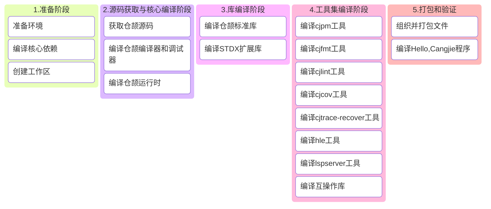

# 仓颉SDK构建指导书 (Ubuntu 22.04)

## 1 构建概述

本指导书用于指导用户：在 Linux 系统中搭建 Cangjie SDK 构建环境及集成构建包含全部组件的 `windows-x64-android` Cangjie SDK。

### 1.1 构建流程全景图



### 1.2 关键注意事项

1. **环境隔离**：所有自定义依赖安装在 `/opt/buildtools`，避免污染系统路径
2. **内存要求**：完整构建需要 ≥8GB 内存，建议添加 4GB 交换空间
3. **网络要求**：首次构建需下载约 3GB 数据，请确保稳定网络连接
4. **windows工具链支持**：需要编译LLVM-MinGW-w64以及配套工具链
5. **Android NDK工具链**：本文以Android NDK r26d为例，支持Android 26+
6. **芯片指令集**：x86_64

## 2 环境准备

### 2.1 系统要求

- **操作系统**: 以 Ubuntu 22.04 LTS 作为示例，其他版本也可以参考本文流程
- **磁盘空间**: ≥50GB
- **内存**: ≥8GB (物理内存+交换空间)
- **用户权限**: 普通用户 + sudo权限


> 您可以选择基于我们提供的Docker环境进行Cangjie SDK构建，该docker为Ubuntu 18.04，已内置所有构建Cangjie所需的系统工具和构建工具：
>
> ```bash
> docker pull swr.cn-north-4.myhuaweicloud.com/cj-docker/cangjie_ubuntu18_x86_kernel:v2.9
> ```

### 2.2 系统工具安装

- 使用华为镜像源(可选)

  ```bash
  # 1.备份配置文件：
  sudo cp -a /etc/apt/sources.list /etc/apt/sources.list.bak;
  # 2.修改sources.list文件，将http://archive.ubuntu.com和http://security.ubuntu.com替换成http://mirrors.huaweicloud.com，可以参考如下命令：
  sudo sed -i "s@http://.*archive.ubuntu.com@http://mirrors.huaweicloud.com@g" /etc/apt/sources.list;
  sudo sed -i "s@http://.*security.ubuntu.com@http://mirrors.huaweicloud.com@g" /etc/apt/sources.list;
  # 3.更新索引
  sudo apt-get update;
  ```

- 安装系统工具

  ```bash
  sudo apt update && sudo apt install -y \
    tar unzip wget curl libcurl4 expat openssl make gcc g++ gettext \
    nfs-common libtool sqlite3 zlib1g-dev libssl-dev cmake ninja-build\
    libcurl4-openssl-dev sudo autoconf build-essential rapidjson-dev \
    texinfo binutils expat libelf-dev libdwarf-dev openssh-client ssh \
    dos2unix libxext-dev libxtst-dev libxt-dev libcups2-dev clang clang-15 libedit-dev\
    libxrender-dev zip bzip2 libopenmpi-dev vim gdb lldb libclang-15-dev libgtest-dev\
    rpm patch libtinfo5 cpio rpm2cpio libncurses5 libncurses5-dev strace net-tools;
  ```

### 2.3 编译MinGW-w64及配套工具链 

```bash
# 创建工作目录
export BUILD_ROOT=/opt/buildtools;
sudo mkdir -p $BUILD_ROOT;
sudo chown $USER:$USER $BUILD_ROOT;
export INSTALL_PATH=${BUILD_ROOT}/llvm-mingw-w64
export tmp_cpus=$(grep -w processor /proc/cpuinfo|wc -l);

cd $BUILD_ROOT;

# install mingw llvm toolchain
wget https://github.com/mstorsjo/llvm-mingw/archive/refs/tags/20220906.tar.gz -q --no-check-certificate;
tar xf 20220906.tar.gz;
cd llvm-mingw-20220906
git init llvm-project && cd llvm-project;
git remote add origin https://gitee.com/openharmony/third_party_llvm-project.git;
git fetch --depth 1 origin 5c68a1cb123161b54b72ce90e7975d95a8eaf2a4 && git checkout FETCH_HEAD;
cd .. && git clone https://gitee.com/openharmony/third_party_mingw-w64.git mingw-w64;
export TOOLCHAIN_ARCHS=x86_64
./build-llvm.sh ${INSTALL_PATH} --disable-lldb
./strip-llvm.sh ${INSTALL_PATH}
./install-wrappers.sh ${INSTALL_PATH}
./build-mingw-w64.sh ${INSTALL_PATH} --with-default-msvcrt=msvcrt
./build-mingw-w64-tools.sh ${INSTALL_PATH}
./build-compiler-rt.sh ${INSTALL_PATH}
./build-libcxx.sh ${INSTALL_PATH}
./build-mingw-w64-libraries.sh ${INSTALL_PATH}
cp ${INSTALL_PATH}/x86_64-w64-mingw32/lib/libmingwex.a ${INSTALL_PATH}/x86_64-w64-mingw32/lib/libssp.a
cp ${INSTALL_PATH}/x86_64-w64-mingw32/lib/libmingwex.a ${INSTALL_PATH}/x86_64-w64-mingw32/lib/libssp_nonshared.a

# build openssl
wget https://github.com/openssl/openssl/archive/refs/tags/openssl-3.0.9.tar.gz -q --no-check-certificate;
tar xf openssl-3.0.9.tar.gz;
cd "$BUILD_ROOT/openssl-openssl-3.0.9";
mkdir build;
cd build;
../Configure mingw64 --prefix="${INSTALL_PATH}/x86_64-w64-mingw32" --cross-compile-prefix=${INSTALL_PATH}/bin/x86_64-w64-mingw32- --libdir=lib;
make -j $tmp_cpus > build.log;
make install > install.log;
```

### 2.4 安装 Python-MinGW

交叉编译windows-x64的 cjdb 需要 Python-MinGW

```bash
INSTALL_PATH=/opt/buildtools/windows
mkdir -p ${INSTALL_PATH}
wget https://mirrors.huaweicloud.com/python/3.11.4/python-3.11.4-embed-amd64.zip --no-check-certificate
wget https://repo.huaweicloud.com/harmonyos/compiler/python/3.11.4/windows/python-mingw-x86-3.11.4_20250617.tar.gz --no-check-certificate
cp -r python-3.11.4-embed-amd64.zip ${INSTALL_PATH}
cp -r python-mingw-x86-3.11.4_20250617.tar.gz ${INSTALL_PATH}
cd ${INSTALL_PATH}
tar -zxf ${INSTALL_PATH}/python-mingw-x86-3.11.4_20250617.tar.gz
mv ${INSTALL_PATH}/windows-x86/3.11.4 ${INSTALL_PATH}/windows-x86/python-3.11.4
unzip ${INSTALL_PATH}/python-3.11.4-embed-amd64.zip -d ${INSTALL_PATH}/windows-x86/python-3.11.4
```

### 2.5 安装 Andoird NDK r26d

```bash
install_dir=/opt/buildtools/android-ndk-r26d
mkdir -p ${install_dir}
tmp_cpus=$(grep -w processor /proc/cpuinfo|wc -l)

wget https://dl.google.com/android/repository/android-ndk-r26d-linux.zip -q --no-check-certificate;
git clone https://gitcode.com/openharmony/third_party_openssl.git -b OpenHarmony-v6.0-Release openssl-3.0.9

unzip -qo android-ndk-r26d-linux.zip
mv android-ndk-r26d/* ${install_dir}
export PATH="$install_dir/toolchains/llvm/prebuilt/linux-x86_64/bin:$PATH"
export ANDROID_NDK_ROOT=${install_dir}
mkdir -p ${install_dir}/toolchains/llvm/prebuilt/linux-x86_64/sysroot/usr/local
ls -l ${install_dir}/toolchains/llvm/prebuilt/linux-x86_64/sysroot/usr/

cd openssl-3.0.9
# cofiguring
mkdir -p build
cd build
../Configure android-arm64 -D__ANDROID_API__=31 --prefix=${install_dir}/toolchains/llvm/prebuilt/linux-x86_64/sysroot/usr/local --with-zlib-include=${install_dir}/toolchains/llvm/prebuilt/linux-x86_64/sysroot/usr/include --with-zlib-lib=${install_dir}/toolchains/llvm/prebuilt/linux-x86_64/sysroot/usr/lib
# building
make -j $tmp_cpus
make install_sw
```

### 2.6 设置环境变量

#### (1) OpenSSL环境变量设置

构建 Cangjie 标准库和 Stdx 扩展库依赖 OpenSSL 3+，在前面（2.2 章节中系统工具安装 - 安装系统工具）中，我们已经安装了OpenSSL库，现在我们需要设置`OPENSSL_PATH`环境变量：

 - 定位OpenSSL的lib目录

   库文件位置：默认在 `/usr/lib/x86_64-linux-gnu/`（x86_64），验证方法：

   ```bash
   # 查找libssl.so
   ls /usr/lib/x86_64-linux-gnu/libssl.so*
   # 查找libcrypto.so
   ls /usr/lib/x86_64-linux-gnu/libcrypto.so*
   ```

 - 设置 OPENSSL_PATH 环境变量

   **<font color="red">\* 下方示例的`/path/to/openssl-3.x`需更换为您的 `openssl` lib目录</font>**

   ```bash
   export OPENSSL_PATH=/path/to/openssl-3.x
   export LD_LIBRARY_PATH=$OPENSSL_PATH:$LD_LIBRARY_PATH
   ```

- 若您正在使用官方镜像，可以使用下方设置

  ```bash
  # x86_64
  export OPENSSL_PATH=${BUILD_ROOT}/openssl-3.0.9/lib64;
  ```

#### (2) 其他环境变量设置

在进行后续操作步骤前，需要配置以下环境变量：

```bash
export MINGW_PATH=${BUILD_ROOT}/llvm-mingw-w64 # MinGW 环境变量配置
export ANDROID_NDK_ROOT=/opt/buildtools/android-ndk-r26d
export PATH=${MINGW_PATH}/bin:/usr/lib/llvm-15/bin:$PATH; # 用于将MinGW、clang-15加入环境变量
export TARGET_PYTHON_PATH=/opt/buildtools/windows/windows-x86/python-3.11.4 # 设置cjdb所需的Python依赖位置
export CANGJIE_VERSION=1.0.0 # Cangjie SDK版本号
export STDX_VERSION=1 # Stdx 版本号
```

## 3 源码准备

### 3.1 创建工作区

**<font color="red">\* 下方示例的`/path/to/workspace`需更换为您构建仓颉SDK的工作目录</font>**

```bash
export WORKSPACE=/path/to/workspace
mkdir -p $WORKSPACE;
cd $WORKSPACE;
```

### 3.2 获取仓颉源码

```bash
git clone https://gitcode.com/Cangjie/cangjie_compiler.git -b dev;
git clone https://gitcode.com/Cangjie/cangjie_runtime.git -b dev;
git clone https://gitcode.com/Cangjie/cangjie_tools.git -b dev;
git clone https://gitcode.com/Cangjie/cangjie_stdx.git -b dev;
```

## 4 编译流程

### 4.1 编译仓颉编译器和调试器

```bash
# 编译linux x64 compiler
cd ${WORKSPACE}/cangjie_compiler;
python3 build.py clean;
python3 build.py build -t release --no-tests -v ${CANGJIE_VERSION};

# 编译windows compiler + cjdb
export CMAKE_PREFIX_PATH=${MINGW_PATH}/x86_64-w64-mingw32;
python3 build.py build -t release \
  --product cjc \
  -v ${CANGJIE_VERSION} \
  --no-tests \
  --target windows-x86_64 \
  --target-sysroot ${MINGW_PATH}/ \
  --target-toolchain ${MINGW_PATH}/bin \
  --build-cjdb;
python3 build.py build -t release \
  --product libs \
  --target windows-x86_64 \
  --target-sysroot ${MINGW_PATH}/ \
  --target-toolchain ${MINGW_PATH}/bin;
  
# 编译android frontend
python3 build.py build -t release \
  --target android26-aarch64 \
  --android-ndk ${ANDROID_NDK_ROOT}

python3 build.py install;
python3 build.py install --host windows-x86_64;
python3 build.py install --host android26-aarch64;

cp -rf output-aarch64-linux-android26/* output-x86_64-w64-mingw32;
cp -Rf output-x86_64-w64-mingw32/* output;
```

验证安装：
```bash
source output/envsetup.sh;
cjc -v;
```

### 4.2 编译仓颉运行时

```bash
cd ${WORKSPACE}/cangjie_runtime/runtime;

# 编译 runtime
python3 build.py clean;
python3 build.py build -t release -v ${CANGJIE_VERSION};
python3 build.py install;
python3 build.py build -t release \
  --target windows-x86_64 \
  --target-toolchain ${MINGW_PATH}/bin \
  -v ${CANGJIE_VERSION};
python3 build.py install;
python3 build.py build -t release \
  --target android26-aarch64 \
  --target-toolchain ${ANDROID_NDK_ROOT}/toolchains \
  -v ${CANGJIE_VERSION};
python3 build.py install;
cp -R output/common/linux_release_x86_64/{lib,runtime}          ${WORKSPACE}/cangjie_compiler/output;
cp -R output/common/windows_release_x86_64/{lib,runtime}        ${WORKSPACE}/cangjie_compiler/output;
cp -R output/common/linux_android_release_aarch64/{lib,runtime} ${WORKSPACE}/cangjie_compiler/output;
cp -R output/common/windows_release_x86_64/{lib,runtime}        ${WORKSPACE}/cangjie_compiler/output-x86_64-w64-mingw32;
cp -R output/common/linux_android_release_aarch64/{lib,runtime} ${WORKSPACE}/cangjie_compiler/output-x86_64-w64-mingw32;
```

### 4.3 编译仓颉标准库

```bash
cd ${WORKSPACE}/cangjie_runtime/stdlib;

# 编译 stdlib
python3 build.py clean;
python3 build.py build -t release \
  --target-lib=$WORKSPACE/cangjie_runtime/runtime/output \
  --target-lib=$OPENSSL_PATH;
cp -rf ${WORKSPACE}/cangjie_runtime/stdlib/output/* ${WORKSPACE}/cangjie_compiler/output/;
python3 build.py clean;
python3 build.py build -t release \
  --target windows-x86_64 \
  --target-lib=${WORKSPACE}/cangjie_runtime/runtime/output \
  --target-lib=${MINGW_PATH}/x86_64-w64-mingw32/lib \
  --target-sysroot ${MINGW_PATH}/ \
  --target-toolchain ${MINGW_PATH}/bin;
python3 build.py build -t release \
  --target android26-aarch64 \
  --target-lib=${WORKSPACE}/cangjie_runtime/runtime/output \
  --target-toolchain ${ANDROID_NDK_ROOT}/toolchains/llvm/prebuilt/linux-x86_64/bin
python3 build.py install;
cp -rf ${WORKSPACE}/cangjie_runtime/stdlib/output/* ${WORKSPACE}/cangjie_compiler/output/;
cp -rf ${WORKSPACE}/cangjie_runtime/stdlib/output/* ${WORKSPACE}/cangjie_compiler/output-x86_64-w64-mingw32/;
```

### 4.4 编译 Stdx 扩展库

```bash
cd ${WORKSPACE}/cangjie_stdx;
python3 build.py clean;
python3 build.py build -t release \
  --target-lib=${MINGW_PATH}/x86_64-w64-mingw32/lib \
	--target windows-x86_64 \
  --target-sysroot ${MINGW_PATH}/ \
  --target-toolchain ${MINGW_PATH}/bin;
python3 build.py install;
export CANGJIE_STDX_PATH=${WORKSPACE}/cangjie_stdx/target/windows_x86_64_cjnative/static/stdx;
```

### 4.5 编译工具集

#### (1) cjpm

```bash
cd ${WORKSPACE}/cangjie_tools/cjpm/build;
python3 build.py clean;
python3 build.py build -t release --target windows-x86_64;
python3 build.py install;
mkdir -p cangjie/tools/config;
cp $WORKSPACE/cangjie_tools/cjpm/dist/cjpm.exe ${WORKSPACE}/cangjie_compiler/output-x86_64-w64-mingw32/tools/bin;
mv $WORKSPACE/cangjie_tools/cjpm/dist/*.toml   ${WORKSPACE}/cangjie_compiler/output-x86_64-w64-mingw32/tools/config;
```

#### (2) cjfmt

```bash
cd ${WORKSPACE}/cangjie_tools/cjfmt/build;
python3 build.py clean;
python3 build.py build -t release --target windows-x86_64;
python3 build.py install;
cp $WORKSPACE/cangjie_tools/cjfmt/dist/bin/cjfmt.exe ${WORKSPACE}/cangjie_compiler/output-x86_64-w64-mingw32/tools/bin;
cp $WORKSPACE/cangjie_tools/cjfmt/config/*.toml      ${WORKSPACE}/cangjie_compiler/output-x86_64-w64-mingw32/tools/config;
```

#### (3) cjlint

```bash
cd ${WORKSPACE}/cangjie_tools/cjlint/build;
python3 build.py clean;
python3 build.py build -t release --target windows-x86_64;
python3 build.py install;
cp $WORKSPACE/cangjie_tools/cjlint/dist/bin/cjlint.exe ${WORKSPACE}/cangjie_compiler/output-x86_64-w64-mingw32/tools/bin;
cp $WORKSPACE/cangjie_tools/cjlint/dist/lib/*          ${WORKSPACE}/cangjie_compiler/output-x86_64-w64-mingw32/tools/lib;
cp $WORKSPACE/cangjie_tools/cjlint/dist/config/*       ${WORKSPACE}/cangjie_compiler/output-x86_64-w64-mingw32/tools/config;
```

#### (4) cjcov

```bash
cd ${WORKSPACE}/cangjie_tools/cjcov/build;
python3 build.py clean;
python3 build.py build -t ${build_type} --target windows-x86_64;
python3 build.py install;
cp $WORKSPACE/cangjie_tools/cjcov/dist/cjcov.exe ${WORKSPACE}/cangjie_compiler/output-x86_64-w64-mingw32/tools/bin;
```

#### (5) cjtrace-recover

```bash
cd ${WORKSPACE}/cangjie_tools/cjtrace-recover/build;
python3 build.py clean;
python3 build.py build -t release --target windows-x86_64 --target-sysroot ${MINGW_PATH};
python3 build.py install --prefix ${WORKSPACE}/cangjie_compiler/output-x86_64-w64-mingw32/tools;
```

#### (6) HyperLangExtension

```bash
cd ${WORKSPACE}/cangjie_tools/hyperlangExtension/build;
python3 build.py clean;
python3 build.py build -t release --target windows-x86_64;
python3 build.py install;
cp $WORKSPACE/cangjie_tools/hyperlangExtension/target/bin/main.exe ${WORKSPACE}/cangjie_compiler/output-x86_64-w64-mingw32/tools/bin/hle.exe;
cp -r $WORKSPACE/cangjie_tools/hyperlangExtension/src/dtsparser ${WORKSPACE}/cangjie_compiler/output-x86_64-w64-mingw32/tools;
rm -rf ${WORKSPACE}/cangjie_compiler/output-x86_64-w64-mingw32/tools/dtsparser/*.cj;
```

#### (7) LSP Server

```bash
cd ${WORKSPACE}/cangjie_tools/cangjie-language-server/build;
python3 build.py clean;
python3 build.py build -t release --target windows-x86_64;
python3 build.py install;
cp $WORKSPACE/cangjie_tools/cangjie-language-server/output/bin/LSPServer.exe ${WORKSPACE}/cangjie_compiler/output-x86_64-w64-mingw32/tools/bin;
```

#### (8) Java Interop

```bash
cd ${WORKSPACE}/cangjie_multiplatform_interop/java/build
# java-mirror-gen
python3 build.py clean;
python3 build.py build;
python3 build.py install --prefix ${WORKSPACE}/cangjie_compiler/output;

# interoplib linux_x86_64
python3 build.py clean;
python3 build.py build --target-lib linux_x86_64_cjnative;
python3 build.py install --target linux_x86_64 --prefix ${WORKSPACE}/cangjie_compiler/output;

# interoplib aarch64-linux-android
export PATH=${ANDROID_NDK_ROOT}/toolchains/llvm/prebuilt/linux-x86_64/bin:$PATH;
source ${WORKSPACE}/cangjie_compiler/output/envsetup.sh;
python3 build.py clean;
python3 build.py build -t release \
  --target aarch64-linux-android26 \
  --target-sysroot ${ANDROID_NDK_ROOT}/toolchains/llvm/prebuilt/linux-x86_64/sysroot \
  --target-toolchain ${ANDROID_NDK_ROOT}/toolchains/llvm/prebuilt/linux-x86_64/bin \
  --target-lib linux_android_aarch64_cjnative;
python3 build.py install --target linux_android_aarch64 --prefix ${WORKSPACE}/cangjie_compiler/output;
```

## 5 打包发布

### 5.1 组织文件

```bash
# 清空历史构建
mkdir -p $WORKSPACE/software;
rm -rf $WORKSPACE/software/*;
cd $WORKSPACE/software;

# 拷贝cangjie目录
cp -R $WORKSPACE/cangjie_compiler/output-x86_64-w64-mingw32 cangjie;
cp $WORKSPACE/cangjie_compiler/LICENSE cangjie;
cp $WORKSPACE/cangjie_compiler/Open_Source_Software_Notice.docx cangjie;

# 打包和设置权限
chmod -R 750 cangjie
zip -qr cangjie-sdk-windows-x64-${CANGJIE_VERSION}.zip cangjie;
chmod 550 cangjie-sdk-windows-x64-${CANGJIE_VERSION}.zip;
```

### 5.2 组织并打包 Stdx

```bash
cd $WORKSPACE/software;
# 拷贝stdx目录
cp -r $WORKSPACE/cangjie_stdx/target/windows_x86_64_cjnative ./;
cp $WORKSPACE/cangjie_stdx/LICENSE windows_x86_64_cjnative;
cp $WORKSPACE/cangjie_stdx/Open_Source_Software_Notice.docx windows_x86_64_cjnative;
chmod -R 750 windows_x86_64_cjnative;
zip -qr cangjie-stdx-windows-x64-${CANGJIE_VERSION}.${STDX_VERSION}.zip windows_x86_64_cjnative;
chmod 550 cangjie-stdx-windows-x64-${CANGJIE_VERSION}.${STDX_VERSION}.zip;
```

## 6 编译Hello, Cangjie程序

检查生成的文件：

```bash
ls -lh $WORKSPACE/software
# 应包含：
# - cangjie-sdk-windows-x64-${CANGJIE_VERSION}.zip
# - cangjie-stdx-windows-x64-${CANGJIE_VERSION}.${STDX_VERSION}.zip
```

验证hello cangjie程序（请在windows执行以下命令）：

1. 安装仓颉SDK

   - 若使用 Windows 命令提示符（CMD）环境，请执行：

     ```bash
     path\to\cangjie\envsetup.bat
     ```

   - 若使用 PowerShell 环境，请执行：

     ```bash
     . path\to\cangjie\envsetup.ps1
     ```

   - 若使用 MSYS shell、bash 等环境，请执行：

     ```bash
     source path/to/cangjie/envsetup.sh
     ```

2. 创建并运行cj文件：

   ```bash
   echo "main() { println(\"Hello, Cangjie\") }" > hello.cj
   cjc hello.cj -o hello.exe && ./hello.exe
   # 应打印：
   # Hello, Cangjie
   ```

🎉 恭喜您成功构建了仓颉SDK并运行了Hello, Cangjie程序！