# 仓颉SDK构建指导书 (Ubuntu 22.04)

## 1 构建概述

### 1.1 构建流程全景图

```mermaid
graph LR
    A[准备环境] --> B[编译核心<br>依赖]
    B --> C[创建<br>工作区]
    C --> D[获取<br>仓颉源码]
    D --> E[编译仓颉<br>编译器和调试器]
    E --> F[编译<br>仓颉运行时]
    F --> G[编译<br>仓颉标准库]
    G --> H[编译<br>STDX扩展库]
    H --> I[编译<br>仓颉工具集]
    I --> J[组织并<br>打包文件]
    J --> K[编译<br>Hello,Cangjie程序]
```



### 1.2 关键注意事项

1. **静态编译（可选）**：libedit 和 ncurses 库需源码编译静态版本，方可确保生成的 SDK 在满足以下条件的 Linux 发行版中稳定运行：
   - glibc 版本 ≥ 编译环境版本
   - Linux Kernel 版本与编译环境一致
2. **环境隔离**：所有自定义依赖安装在 `/opt/buildtools`，避免污染系统路径
3. **内存要求**：完整构建需要 ≥8GB 内存，建议添加 4GB 交换空间
4. **网络要求**：首次构建需下载约 3GB 数据，请确保稳定网络连接
5. **芯片指令集**：请**务必**根据您的计算机芯片架构(x86_64或aarch64)设置对应的环境变量，以及选择合适的系统工具及docker镜像（uname -m)

## 2 环境准备

### 2.1 系统要求

- **操作系统**: Ubuntu 22.04 LTS
- **磁盘空间**: ≥50GB
- **内存**: ≥8GB (物理内存+交换空间)
- **用户权限**: 普通用户 + sudo权限

> 您可以自己搭建相关构建环境，也可以基于我们提供的Docker环境进行Cangjie SDK构建，里面已内置所有构建Cangjie所需的系统工具和构建工具：
>
> ```bash
> docker pull swr.cn-north-4.myhuaweicloud.com/cj-docker/cangjie_ubuntu18_x86_kernel:v2.8
> # 或
> docker pull swr.cn-north-4.myhuaweicloud.com/cj-docker/cangjie_ubuntu18_arm_kernel:v2.2
> ```

### 2.2 系统工具安装

- 使用华为镜像源(可选)

  ```bash
  # 1.备份配置文件：
  sudo cp -a /etc/apt/sources.list /etc/apt/sources.list.bak;
  # 2.修改sources.list文件，将http://archive.ubuntu.com和http://security.ubuntu.com替换成http://mirrors.huaweicloud.com，可以参考如下命令：
  sudo sed -i "s@http://.*archive.ubuntu.com@http://mirrors.huaweicloud.com@g" /etc/apt/sources.list;
  sudo sed -i "s@http://.*security.ubuntu.com@http://mirrors.huaweicloud.com@g" /etc/apt/sources.list;
  # 3.更新索引
  sudo apt-get update;
  ```

- 安装系统工具

  ```bash
  sudo apt update && sudo apt install -y \
    tar unzip wget curl libcurl4 expat openssl make gcc g++ gettext \
    nfs-common libtool sqlite3 zlib1g-dev libssl-dev cmake ninja-build\
    libcurl4-openssl-dev sudo autoconf build-essential rapidjson-dev \
    texinfo binutils expat libelf-dev libdwarf-dev openssh-client ssh \
    dos2unix libxext-dev libxtst-dev libxt-dev libcups2-dev clang clang-15 libedit-dev\
    libxrender-dev zip bzip2 libopenmpi-dev vim gdb lldb libclang-15-dev libgtest-dev\
    rpm patch libtinfo5 cpio rpm2cpio libncurses5 libncurses5-dev strace net-tools;
  ```

### 2.3 静态库编译 (可选)

libedit 和 ncurses 库**并非必须源码编译**，也可使用系统预编译版本。

```bash
# 创建工作目录
export BUILD_ROOT=/opt/buildtools;
sudo mkdir -p $BUILD_ROOT;
sudo chown $USER:$USER $BUILD_ROOT;
tmp_cpus=$(grep -w processor /proc/cpuinfo|wc -l);
```

#### (1) 编译 ncurses 6.5 (静态)

```bash
cd $BUILD_ROOT;
git clone https://gitcode.com/openharmony/third_party_ncurses.git -b OpenHarmony-v6.0-Release ncurses-6.5;
cd ncurses-6.5;
./configure --with-termlib CC=clang CXX=clang++ CFLAGS=-fPIC CPPFLAGS=-fPIC CFLAGS="-fstack-protector-strong -Wl,-z,relro,-z,now,-z,noexecstack" CXXFLAGS="-fstack-protector-strong -Wl,-z,relro,-z,now,-z,noexecstack" --with-terminfo-dirs=/etc/terminfo:/lib/terminfo:/usr/share/terminfo --disable-widec --disable-overwrite --disable-root-environ;
make -j ${tmp_cpus};
make install DESTDIR=${BUILD_ROOT}/ncurses-6.5;
```

#### (2) 编译 libedit 3.1 (静态)

```bash
cd $BUILD_ROOT;
git clone https://gitcode.com/openharmony/third_party_libedit.git -b OpenHarmony-5.0.0-Release;
tar xf libedit-20210910-3.1.tar.gz;
cd libedit-20210910-3.1;
./configure --with-pic --enable-shared=no --prefix=${BUILD_ROOT}/libedit-3.1;
make -j ${tmp_cpus};
make install;
```

### 2.4 设置环境变量

#### (1) OpenSSL环境变量设置

构建Cangjie标准库和STDX扩展库依赖OpenSSL，在前面(2.2 系统工具安装 - 安装系统工具)中，我们已经安装了OpenSSL库，现在我们需要设置`OPENSSL_PATH`环境变量：

 - 定位OpenSSL的lib目录
    
    库文件位置：默认在 /usr/lib/x86_64-linux-gnu/（x86_64）或 /usr/lib/aarch64-linux-gnu/（aarch64）
    
    验证方法：
    
    ```bash
    # 查找libssl.so
    ls /usr/lib/x86_64-linux-gnu/libssl.so*
    # 查找libcrypto.so
    ls /usr/lib/x86_64-linux-gnu/libcrypto.so*
    ```
 - 设置 OPENSSL_PATH 环境变量

    ```bash
    export OPENSSL_PATH=/usr/lib/x86_64-linux-gnu;
    export LD_LIBRARY_PATH=$OPENSSL_PATH:$LD_LIBRARY_PATH
    ```

#### (2) 其他环境变量设置

请务必在构建前配置以下环境变量：

```bash
export PATH=/usr/lib/llvm-15/bin:$PATH; # 用于将clang-15加入环境变量
export ARCH=x86_64 # 或aarch64
export SDK_NAME=linux-x64 # 或linux-aarch64
# 以下变量仅影响文件名
export CANGJIE_VERSION=1.0.0
export STDX_VERSION=1
```

## 3. 源码准备

### 3.1 创建工作区

**<font color="red">\* 下方示例的`/path/to/workspace`需更换为您构建Cangjie SDK的工作目录</font>**

```bash
export WORKSPACE=/path/to/workspace
mkdir -p $WORKSPACE;
cd $WORKSPACE;
```

### 3.2 获取Cangjie源码

```bash
git clone https://gitcode.com/Cangjie/cangjie_compiler.git;
git clone https://gitcode.com/Cangjie/cangjie_runtime.git;
git clone https://gitcode.com/Cangjie/cangjie_tools.git;
git clone https://gitcode.com/Cangjie/cangjie_stdx.git;
```

## 4 编译流程

### 4.1 编译仓颉编译器和调试器

> 您可以通过CMAKE_PREFIX_PATH和--target-lib使用您编译的静态库（可选）

```bash
export CMAKE_PREFIX_PATH=$BUILD_ROOT/libedit-3.1:$BUILD_ROOT/ncurses-6.3/usr;
```

执行构建：

```bash
cd $WORKSPACE/cangjie_compiler;
python3 build.py clean;
python3 build.py build -t release \
  --no-tests \
  --target-lib=$BUILD_ROOT/ncurses-6.3/usr/lib \
  --build-cjdb;
python3 build.py install;
```

验证安装：
```bash
source output/envsetup.sh;
cjc -v;
```

### 4.2 编译仓颉运行时

```bash
cd $WORKSPACE/cangjie_runtime/runtime;
python3 build.py clean;
python3 build.py build -t release -v ${CANGJIE_VERSION};
python3 build.py install;
cp -R output/common/linux_release_${ARCH}/{lib,runtime} $WORKSPACE/cangjie_compiler/output;
```

### 4.3 编译仓颉标准库

```bash
cd $WORKSPACE/cangjie_runtime/stdlib;
python3 build.py clean;
python3 build.py build -t release \
  --target-lib=$WORKSPACE/cangjie_runtime/runtime/output
python3 build.py install;
cp -R $WORKSPACE/cangjie_runtime/stdlib/output/* $WORKSPACE/cangjie_compiler/output/;
```

### 4.4 编译 STDX扩展库

```bash
cd $WORKSPACE/cangjie_stdx;
python3 build.py clean;
python3 build.py build -t release \
  --include=$WORKSPACE/cangjie_compiler/include
python3 build.py install;
export CANGJIE_STDX_PATH=$WORKSPACE/cangjie_stdx/target/linux_${ARCH}_cjnative/static/stdx;
```

### 4.5 编译工具集

#### (1) cjpm

```bash
cd $WORKSPACE/cangjie_tools/cjpm/build;
python3 build.py clean;
python3 build.py build -t release --set-rpath \$ORIGIN/../../runtime/lib/linux_${ARCH}_cjnative;
python3 build.py install;
```

#### (2) cjfmt

```bash
cd $WORKSPACE/cangjie_tools/cjfmt/build;
python3 build.py clean;
python3 build.py build -t release;
python3 build.py install;
```

#### (3) HyperLangExtension

```bash
cd $WORKSPACE/cangjie_tools/hyperlangExtension/build;
python3 build.py clean;
python3 build.py build -t release;
python3 build.py install;
```

#### (4) LSP Server

```bash
cd $WORKSPACE/cangjie_tools/cangjie-language-server/build;
python3 build.py clean;
python3 build.py build -t release;
python3 build.py install;
```

## 5 组织并打包文件

### 5.1 组织并打包 SDK

```bash
# 清空历史构建
mkdir -p $WORKSPACE/software;
rm -rf $WORKSPACE/software/*;
cd $WORKSPACE/software;

# 拷贝cangjie目录
cp -R $WORKSPACE/cangjie_compiler/output cangjie;

# 删除 ast-support.a
rm -rf cangjie/lib/linux_${ARCH}_cjnative/libcangjie-ast-support.a

# 组织文件
cp $WORKSPACE/cangjie_tools/cjpm/dist/cjpm cangjie/tools/bin/cjpm;
mkdir -p cangjie/tools/config;
cp $WORKSPACE/cangjie_tools/cjfmt/build/build/bin/cjfmt cangjie/tools/bin;
cp $WORKSPACE/cangjie_tools/cjfmt/config/*.toml cangjie/tools/config;
cp $WORKSPACE/cangjie_tools/hyperlangExtension/target/bin/main cangjie/tools/bin/hle;
cp -r $WORKSPACE/cangjie_tools/hyperlangExtension/src/dtsparser cangjie/tools;
rm -rf cangjie/tools/dtsparser/*.cj;
cp $WORKSPACE/cangjie_tools/cangjie-language-server/output/bin/LSPServer cangjie/tools/bin;

# 打包和设置权限
chmod -R 750 cangjie
tar --format=gnu -zcvf cangjie-sdk-${SDK_NAME}-${CANGJIE_VERSION}.tar.gz cangjie;
chmod 550 cangjie-sdk-${SDK_NAME}-${CANGJIE_VERSION}.tar.gz;
```

### 5.2 组织并打包 STDX

```bash
cd $WORKSPACE/software;
# 拷贝stdx目录
cp -r $WORKSPACE/cangjie_stdx/target/linux_${ARCH}_cjnative ./;
chmod -R 750 linux_${ARCH}_cjnative;
zip -qr cangjie-stdx-${SDK_NAME}-${CANGJIE_VERSION}.${STDX_VERSION}.zip linux_${ARCH}_cjnative;
chmod 550 cangjie-stdx-${SDK_NAME}-${CANGJIE_VERSION}.${STDX_VERSION}.zip;
```

## 6 编译Hello, Cangjie程序

检查生成的文件：

```bash
ls -lh $WORKSPACE/software
# 应包含：
# - cangjie-sdk-${SDK_NAME}-${CANGJIE_VERSION}.tar.gz
# - cangjie-stdx-${SDK_NAME}-${CANGJIE_VERSION}.${STDX_VERSION}.zip
```

验证 Hello, Cangjie 程序：

```bash
cd $WORKSPACE;
source $WORKSPACE/software/cangjie/envsetup.sh;
echo "main() { println(\"Hello, Cangjie\") }" > hello.cj
cjc hello.cj -o hello && ./hello
# 您将在控制台看到以下输出：
# Hello, Cangjie
```

🎉 恭喜您成功构建了仓颉SDK并运行了Hello, Cangjie程序！