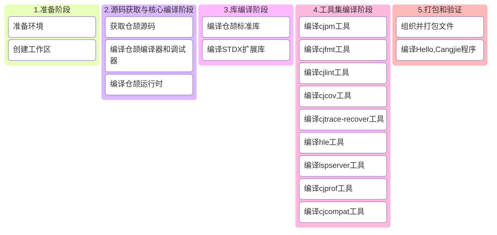

# 仓颉SDK构建指导书

## 1 构建概述

本指导书用于指导用户：在 MacOS 系统中搭建 Cangjie SDK 构建环境及集成构建包含全部组件的 `mac-ohos` Cangjie SDK。

### 构建流程全景图



## 2 环境准备

### 2.1 系统要求

- **操作系统**:  以 macOS 14 Sonoma 作为示例，其他版本也可以参考本文流程
- **磁盘空间**: ≥50GB
- **内存**: ≥8GB (物理内存+交换空间)
- **用户权限**: 普通用户 + sudo权限
- **芯片指令集**：请**务必**根据您的计算机芯片架构(x86_64或aarch64)设置对应的环境变量

### 2.2 系统工具安装

推荐使用`Homebrew`安装编译仓颉所需的依赖：

 - [Homebrew官网](https://brew.sh/zh-cn/)
 - [Homebrew国内镜像](https://developer.aliyun.com/mirror/homebrew/)

#### (1) 安装所需依赖

**1. cmake（要求&gt;=3.17, &lt;4)**

前往[CMake官网](https://cmake.org/download/#previous)下载dmg或tar.gz包手动进行安装：

- 使用dmg安装: 下载后拖入Application中，并执行：

  **<font color="red">\* 下方示例的`/path/to/cmake`需更换为您的自定义安装目录</font>**

  ```bash
  # 下方命令二选一：
  # 安装至/usr/local/bin
  sudo "/Applications/CMake.app/Contents/bin/cmake-gui" --install
  # 自定义安装位置
  sudo "/Applications/CMake.app/Contents/bin/cmake-gui" --install=/path/to/cmake
  
  # 使用前将cmake/bin加入环境变量
  PATH="/Applications/CMake.app/Contents/bin:$PATH”
  ```

- 使用tar.gz: 

  ```bash
  # 解压tar包
  tar -zxvf cmake-3.x.x-macos-universal.tar.gz /path/to/cmake
  # 使用前将cmake/bin加入环境变量或将配置加入~/.zshrc中
  export PATH="/path/to/cmake/bin:$PATH"
  ```

#### (2) 其他必要的构建工具

```bash
brew install python3 ninja llvm@16 openssl@3 bison googletest gnu-tar swig
```

### 2.3 编译ohos-x86_64、ohos-aarch64工具链

[请参考编译ohos-x86_64、ohos-aarch64工具链](linux_ohos_toolchain.md)

```bash
export OHOS_ROOT=/opt/buildtools/ohos_root;
```

### 2.4 设置环境变量

***请在构建前务必设置以下变量：***

```bash
export ARCH=aarch64 # 或x86_64
export CANGJIE_VERSION=1.0.0 # Cangjie SDK 版本
export STDX_VERSION=1 # Stdx 版本
export SDK_NAME=mac-aarch64-ohos # 或mac-x64-ohos
```

**<font color="red">\* 请注意：以下构建工具版本请务必根据您安装的具体版本进行替换</font>**

**<font color="red">\* 下方示例的16.x、1.x、3.x等版本需更换为您所安装的具体版本号</font>**

```bash
export CELLAR_PATH=/path/to/Cellar
# 可使用brew --cellar命令查看
# 对于arm芯片，Cellar通常位于：/opt/homebrew/Cellar
# 对于intel芯片，Cellar通常位于：/usr/local/Cellar

# 如何找到版本号：
# 使用 `brew list --versions` 查看已安装的软件包及其版本号，例如：
# brew list --versions llvm@16
export PATH=$CELLAR_PATH/llvm@16/16.x/bin:$PATH
export OPENSSL_PATH=$CELLAR_PATH/openssl@3/3.x/lib
export LD_LIBRARY_PATH=$OPENSSL_PATH:$LD_LIBRARY_PATH
export DYLD_LIBRARY_PATH=$OPENSSL_PATH:$DYLD_LIBRARY_PATH
```

## 3 源码准备

### 3.1 创建工作区

**<font color="red">\* 下方示例的`/path/to/workspace`需更换为您构建仓颉SDK的工作目录</font>**

```bash
export WORKSPACE=/path/to/workspace
mkdir -p $WORKSPACE;
cd $WORKSPACE;
```

### 3.2 获取仓颉源码

```bash
git clone https://gitcode.com/Cangjie/cangjie_compiler.git -b main;
git clone https://gitcode.com/Cangjie/cangjie_runtime.git -b main;
git clone https://gitcode.com/Cangjie/cangjie_tools.git -b main;
git clone https://gitcode.com/Cangjie/cangjie_stdx.git -b main;
```

## 4 编译流程

### 4.1 编译仓颉编译器和调试器

执行构建:
```bash
cd $WORKSPACE/cangjie_compiler;
python3 build.py clean;
python3 build.py build -t release -v ${CANGJIE_VERSION} --no-tests --build-cjdb;
python3 build.py install;
python3 build.py build -t release \
  --product libs \
  --target ohos-x86_64  \
  --target-toolchain ${OHOS_ROOT}/prebuilts/clang/ohos/darwin_${cmake_arch}/llvm/bin \
  --target-sysroot ${OHOS_ROOT}/out/sdk/obj/third_party/musl/sysroot;
python3 build.py install;
python3 build.py build -t release \
  --product libs \
  --target ohos-aarch64  \
  --target-toolchain ${OHOS_ROOT}/prebuilts/clang/ohos/darwin-${cmake_arch}/llvm/bin \
  --target-sysroot ${OHOS_ROOT}/out/sdk/obj/third_party/musl/sysroot;
python3 build.py install;
```

验证安装：
```bash
source output/envsetup.sh;
cjc -v;
```

### 4.2 编译仓颉运行时

```bash
cd $WORKSPACE/cangjie_runtime/runtime;
python3 build.py clean;
python3 build.py build -t release -v ${CANGJIE_VERSION};
python3 build.py install;
python3 build.py build -t release \
  --target ohos-x86_64 \
  --target-toolchain ${OHOS_ROOT} \
  -v ${cangjie_version};
python3 build.py install;
python3 build.py build -t release \
  --target ohos-aarch64 \
  --target-toolchain ${OHOS_ROOT} \
  -v ${cangjie_version};
python3 build.py install;
cp -R output/common/darwin_release_${ARCH}/{lib,runtime}     ${WORKSPACE}/cangjie_compiler/output;
cp -R output/common/linux_ohos_release_aarch64/{lib,runtime} ${WORKSPACE}/cangjie_compiler/output;
cp -R output/common/linux_ohos_release_x86_64/{lib,runtime}  ${WORKSPACE}/cangjie_compiler/output;
```

### 4.3 编译仓颉标准库

```bash
cd $WORKSPACE/cangjie_runtime/stdlib;
python3 build.py clean;
python3 build.py build -t release \
  --target-lib=$WORKSPACE/cangjie_runtime/runtime/output \
  --target-lib=$OPENSSL_PATH;
python3 build.py install;
python3 build.py build -t release \
  --target ohos-x86_64 \
  --target-lib=${WORKSPACE}/cangjie_runtime/runtime/output \
  --target-toolchain ${OHOS_ROOT}/prebuilts/clang/ohos/darwin-${ARCH}/llvm/bin \
  --target-sysroot ${OHOS_ROOT}/out/sdk/obj/third_party/musl/sysroot;
python3 build.py install;
python3 build.py build -t release \
  --target ohos-aarch64 \
  --target-lib=${WORKSPACE}/cangjie_runtime/runtime/output \
  --target-toolchain ${OHOS_ROOT}/prebuilts/clang/ohos/darwin-${ARCH}/llvm/bin \
  --target-sysroot ${OHOS_ROOT}/out/sdk/obj/third_party/musl/sysroot;
python3 build.py install;
cp -R output/* $WORKSPACE/cangjie_compiler/output/;
```

### 4.4 编译 Stdx 扩展库

```bash
cd $WORKSPACE/cangjie_stdx;
python3 build.py clean;
python3 build.py build -t release --target-lib=$OPENSSL_PATH --include=${WORKSPACE}/cangjie_compiler/include;
python3 build.py install;
export CANGJIE_STDX_PATH=$WORKSPACE/cangjie_stdx/target/darwin_${ARCH}_cjnative/static/stdx;
```

### 4.5 编译仓颉工具集

#### (1) cjpm

```bash
cd $WORKSPACE/cangjie_tools/cjpm/build;
python3 build.py clean;
python3 build.py build -t release --set-rpath @loader_path/../../runtime/lib/darwin_${ARCH}_cjnative;
python3 build.py install;
mkdir -p ${WORKSPACE}/cangjie_compiler/output/tools/config;
cp ${WORKSPACE}/cangjie_tools/cjpm/dist/cjpm   ${WORKSPACE}/cangjie_compiler/output/tools/bin;
mv ${WORKSPACE}/cangjie_tools/cjpm/dist/*.toml ${WORKSPACE}/cangjie_compiler/output/tools/config;
```

#### (2) cjfmt

```bash
cd ${WORKSPACE}/cangjie_tools/cjfmt/build;
python3 build.py clean;
python3 build.py build -t release;
python3 build.py install;
mv ${WORKSPACE}/cangjie_tools/cjfmt/build/build/bin/cjfmt ${WORKSPACE}/cangjie_compiler/output/tools/bin;
mv ${WORKSPACE}/cangjie_tools/cjfmt/config/*.toml         ${WORKSPACE}/cangjie_compiler/output/tools/config;
```

#### (3) cjlint

```bash
cd ${WORKSPACE}/cangjie_tools/cjlint/build;
python3 build.py clean;
python3 build.py build -t release;
python3 build.py install;
mv ${WORKSPACE}/cangjie_tools/cjlint/dist/bin/cjlint ${WORKSPACE}/cangjie_compiler/output/tools/bin
mv ${WORKSPACE}/cangjie_tools/cjlint/dist/lib/*      ${WORKSPACE}/cangjie_compiler/output/tools/lib
mv ${WORKSPACE}/cangjie_tools/cjlint/dist/config/*   ${WORKSPACE}/cangjie_compiler/output/tools/config
```

#### (4) cjcov

```bash
cd ${WORKSPACE}/cangjie_tools/cjcov/build;
python3 build.py clean;
python3 build.py build -t release;
python3 build.py install;
mv ${WORKSPACE}/cangjie_tools/cjcov/dist/cjcov ${WORKSPACE}/cangjie_compiler/output/tools/bin;
```

#### (5) cjtrace-recover

```bash
cd ${WORKSPACE}/cangjie_tools/cjtrace-recover/build;
python3 build.py clean;
python3 build.py build -t release;
python3 build.py install --prefix ${WORKSPACE}/cangjie_compiler/output/tools;
```

#### (6) HyperLangExtension

```bash
cd $WORKSPACE/cangjie_tools/hyperlangExtension/build;
python3 build.py clean;
python3 build.py build -t release;
python3 build.py install;
cp ${WORKSPACE}/cangjie_tools/hyperlangExtension/target/bin/main  ${WORKSPACE}/cangjie_compiler/output/tools/bin/hle;
cp -R ${WORKSPACE}/cangjie_tools/hyperlangExtension/src/dtsparser ${WORKSPACE}/cangjie_compiler/output/tools;
rm -rf ${WORKSPACE}/cangjie_compiler/output/tools/dtsparser/*.cj;
```

#### (7) LSP Server

```bash
cd $WORKSPACE/cangjie_tools/cangjie-language-server/build;
python3 build.py clean;
python3 build.py build -t release;
python3 build.py install;
cp ${WORKSPACE}/cangjie_tools/cangjie-language-server/output/bin/LSPServer ${WORKSPACE}/cangjie_compiler/output/tools/bin
```

#### (8) cjprof

```bash
cd ${WORKSPACE}/cangjie_tools/cjprof/build;
python3 build.py build -t release;
python3 build.py install;
cp $WORKSPACE/cangjie_tools/cjprof/dist/bin/cjprof ${WORKSPACE}/cangjie_compiler/output/tools/bin
cp $WORKSPACE/cangjie_tools/cjprof/dist/lib/* ${WORKSPACE}/cangjie_compiler/output/tools/lib;
```

#### (9) cjcompat

```bash
cd ${WORKSPACE}/cangjie_tools/cjcompat/build;
python3 build.py build -t release;
python3 build.py install;
cp $WORKSPACE/cangjie_tools/cjcompat/dist/bin/cjcompat ${WORKSPACE}/cangjie_compiler/output/tools/bin
```

## 5 组织并打包文件

### 5.1 组织并打包 SDK

```bash
# 清空历史构建
mkdir -p $WORKSPACE/software;
rm -rf $WORKSPACE/software/*;
cd $WORKSPACE/software;

# 拷贝cangjie目录
cp -R $WORKSPACE/cangjie_compiler/output cangjie;
cp $WORKSPACE/cangjie_compiler/LICENSE cangjie;
cp $WORKSPACE/cangjie_compiler/Open_Source_Software_Notice.docx cangjie;

# 打包和设置权限
chmod -R 750 cangjie
gtar --format=gnu -zcvf cangjie-sdk-${SDK_NAME}-${CANGJIE_VERSION}.tar.gz cangjie;
chmod 550 cangjie-sdk-${SDK_NAME}-${CANGJIE_VERSION}.tar.gz;
```

### 5.2 组织并打包 Stdx

```bash
cd $WORKSPACE/software;
# 拷贝stdx目录
cp -r $WORKSPACE/cangjie_stdx/target/darwin_${ARCH}_cjnative ./;
cp $WORKSPACE/cangjie_stdx/LICENSE darwin_${ARCH}_cjnative;
cp $WORKSPACE/cangjie_stdx/Open_Source_Software_Notice.docx darwin_${ARCH}_cjnative;
chmod -R 750 darwin_${ARCH}_cjnative;
zip -qr cangjie-stdx-${SDK_NAME}-${CANGJIE_VERSION}.${STDX_VERSION}.zip darwin_${ARCH}_cjnative;
chmod 550 cangjie-stdx-${SDK_NAME}-${CANGJIE_VERSION}.${STDX_VERSION}.zip;
```

## 6 编译Hello, Cangjie程序

检查生成的文件：

```bash
ls -lh $WORKSPACE/software
# 应包含：
# - cangjie-sdk-${SDK_NAME}-${CANGJIE_VERSION}.tar.gz
# - cangjie-stdx-mac-${ARCH}-${CANGJIE_VERSION}.${STDX_VERSION}.zip
```

验证 Hello, Cangjie 程序：

```bash
echo "main() { println(\"Hello, Cangjie\") }" > hello.cj
# 鸿蒙PC/手机
cjc hello.cj --target=aarch64-linux-ohos -B${OHOS_ROOT}/out/sdk/obj/third_party/musl/sysroot/usr/lib/aarch64-linux-ohos -L${OHOS_ROOT}/out/sdk/obj/third_party/musl/sysroot/usr/lib/aarch64-linux-ohos
# 模拟器
cjc hello.cj --target=x86_64-linux-ohos -B${OHOS_ROOT}/out/sdk/obj/third_party/musl/sysroot/usr/lib/x86_64-linux-ohos -L${OHOS_ROOT}/out/sdk/obj/third_party/musl/sysroot/usr/lib/x86_64-linux-ohos
# 应打印：
# Hello, Cangjie
```

🎉 恭喜您成功构建了仓颉SDK并运行了Hello, Cangjie程序！