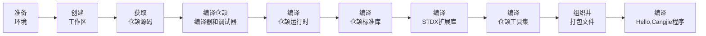

# 仓颉SDK构建指导书 (macOS 14 Sonoma)

## 1 构建概述

### 构建流程全景图



## 2 环境准备

### 2.1 系统要求

- **操作系统**: macOS 14 Sonoma
- **磁盘空间**: ≥50GB
- **内存**: ≥8GB (物理内存+交换空间)
- **用户权限**: 普通用户 + sudo权限
- **芯片指令集**：请**务必**根据您的计算机芯片架构(x86_64或aarch64)设置对应的环境变量

### 2.2 系统工具安装

推荐使用`Homebrew`安装编译仓颉所需的依赖：

 - [Homebrew官网](https://brew.sh/zh-cn/)
 - [Homebrew国内镜像](https://developer.aliyun.com/mirror/homebrew/)

#### (1) 安装所需依赖

**1. cmake（要求&gt;=3.17, &lt;4)**

前往[CMake官网](https://cmake.org/download/#previous)下载dmg或tar.gz包手动进行安装：

- 使用dmg安装: 下载后拖入Application中，并执行：

  **<font color="red">\* 下方示例的`/path/to/cmake`需更换为您的自定义安装目录</font>**

  ```bash
  # 下方命令二选一：
  # 安装至/usr/local/bin
  sudo "/Applications/CMake.app/Contents/bin/cmake-gui" --install
  # 自定义安装位置
  sudo "/Applications/CMake.app/Contents/bin/cmake-gui" --install=/path/to/cmake
  
  # 使用前将cmake/bin加入环境变量
  PATH="/Applications/CMake.app/Contents/bin:$PATH”
  ```

- 使用tar.gz: 

  ```bash
  # 解压tar包
  tar -zxvf cmake-3.x.x-macos-universal.tar.gz /path/to/cmake
  # 使用前将cmake/bin加入环境变量或将配置加入~/.zshrc中
  export PATH="/path/to/cmake/bin:$PATH"
  ```

#### (2) 其他必要的构建工具

```bash
brew install python3 ninja llvm@16 openssl@3 m4 bison googletest gnu-tar
```

### 2.3 设置环境变量

***请在构建前务必设置以下变量：***

```bash
export ARCH=aarch64 # 或x86_64
export SDK_NAME=mac-aarch64 # 或mac-x64
# 以下变量仅影响文件名
export CANGJIE_VERSION=1.0.0
export STDX_VERSION=1
```

**<font color="red">\* 请注意：以下构建工具版本请务必根据您安装的具体版本进行替换</font>**

**<font color="red">\* 下方示例的16.x、1.x、3.x等版本需更换为您所安装的具体版本号</font>**

```bash
export CELLAR_PATH=/path/to/Cellar
# 可使用brew --cellar命令查看
# 对于arm芯片，Cellar通常位于：/opt/homebrew/Cellar
# 对于intel芯片，Cellar通常位于：/usr/local/Cellar

# 如何找到版本号：
# 使用 `brew list --versions` 查看已安装的软件包及其版本号，例如：
# brew list --versions llvm@16
export PATH=$CELLAR_PATH/llvm@16/16.x/bin:$CELLAR_PATH/m4/1.x/bin:$PATH
export OPENSSL_PATH=$CELLAR_PATH/openssl@3/3.x/lib
export LD_LIBRARY_PATH=$OPENSSL_PATH:$LD_LIBRARY_PATH
```

## 3 源码准备

### 3.1 创建工作区

**<font color="red">\* 下方示例的`/path/to/workspace`需更换为您构建仓颉SDK的工作目录</font>**

```bash
export WORKSPACE=/path/to/workspace
mkdir -p $WORKSPACE;
cd $WORKSPACE;
```

### 3.2 获取仓颉源码

```bash
git clone https://gitcode.com/Cangjie/cangjie_compiler.git;
git clone https://gitcode.com/Cangjie/cangjie_runtime.git;
git clone https://gitcode.com/Cangjie/cangjie_tools.git;
git clone https://gitcode.com/Cangjie/cangjie_stdx.git;
```

## 4 编译流程

### 4.1 编译仓颉编译器和调试器

执行构建:
```bash
cd $WORKSPACE/cangjie_compiler;
python3 build.py clean;
python3 build.py build -t release --no-tests --build-cjdb;
python3 build.py install;
```

验证安装：
```bash
source output/envsetup.sh;
cjc -v;
```

### 4.2 编译仓颉运行时

```bash
cd $WORKSPACE/cangjie_runtime/runtime;
python3 build.py clean;
python3 build.py build -t release -v ${CANGJIE_VERSION};
python3 build.py install;
cp -R $WORKSPACE/cangjie_runtime/runtime/output/common/darwin_release_${ARCH}/{lib,runtime} $WORKSPACE/cangjie_compiler/output;
```

### 4.3 编译仓颉标准库

```bash
cd $WORKSPACE/cangjie_runtime/stdlib;
python3 build.py clean;
python3 build.py build -t release \
  --target-lib=$WORKSPACE/cangjie_runtime/runtime/output
python3 build.py install;
cp -R $WORKSPACE/cangjie_runtime/stdlib/output/* $WORKSPACE/cangjie_compiler/output/;
```

### 4.4 编译 STDX 扩展库

```bash
cd $WORKSPACE/cangjie_stdx;
python3 build.py clean;
python3 build.py build -t release \
  --include=$WORKSPACE/cangjie_compiler/include
python3 build.py install;
export CANGJIE_STDX_PATH=$WORKSPACE/cangjie_stdx/target/darwin_${ARCH}_cjnative/static/stdx;
```

### 4.5 编译仓颉工具集

#### (1) cjpm

```bash
cd $WORKSPACE/cangjie_tools/cjpm/build;
python3 build.py clean;
python3 build.py build -t release --set-rpath @loader_path/../../runtime/lib/darwin_${ARCH}_cjnative;
python3 build.py install;
```

#### (2) cjfmt

```bash
cd $WORKSPACE/cangjie_tools/cjfmt/build;
python3 build.py clean;
python3 build.py build -t release;
python3 build.py install;
```

#### (3) HyperLangExtension

```bash
cd $WORKSPACE/cangjie_tools/hyperlangExtension/build;
python3 build.py clean;
python3 build.py build -t release;
python3 build.py install;
```

#### (4) LSP Server

```bash
cd $WORKSPACE/cangjie_tools/cangjie-language-server/build;
python3 build.py clean;
python3 build.py build -t release;
python3 build.py install;
```

## 5 组织并打包文件

### 5.1 组织并打包 SDK

```bash
# 清空历史构建
mkdir -p $WORKSPACE/software;
rm -rf $WORKSPACE/software/*;
cd $WORKSPACE/software;

# 拷贝cangjie目录
cp -R $WORKSPACE/cangjie_compiler/output cangjie;

# 删除 ast-support.a
rm -rf cangjie/lib/darwin_${ARCH}_cjnative/libcangjie-ast-support.a

# 组织文件
cp $WORKSPACE/cangjie_tools/cjpm/dist/cjpm cangjie/tools/bin/cjpm;
mkdir -p cangjie/tools/config;
cp $WORKSPACE/cangjie_tools/cjfmt/build/build/bin/cjfmt cangjie/tools/bin;
cp $WORKSPACE/cangjie_tools/cjfmt/config/*.toml cangjie/tools/config;
cp $WORKSPACE/cangjie_tools/hyperlangExtension/target/bin/main cangjie/tools/bin/hle;
cp -r $WORKSPACE/cangjie_tools/hyperlangExtension/src/dtsparser cangjie/tools;
rm -rf cangjie/tools/dtsparser/*.cj;
cp $WORKSPACE/cangjie_tools/cangjie-language-server/output/bin/LSPServer cangjie/tools/bin;

# 打包和设置权限
chmod -R 750 cangjie
gtar --format=gnu -zcvf cangjie-sdk-${SDK_NAME}-${CANGJIE_VERSION}.tar.gz cangjie;
chmod 550 cangjie-sdk-${SDK_NAME}-${CANGJIE_VERSION}.tar.gz;
```

### 5.2 组织并打包 STDX

```bash
cd $WORKSPACE/software;
# 拷贝stdx目录
cp -r $WORKSPACE/cangjie_stdx/target/darwin_${ARCH}_cjnative ./;
chmod -R 750 darwin_${ARCH}_cjnative;
zip -qr cangjie-stdx-${SDK_NAME}-${CANGJIE_VERSION}.${STDX_VERSION}.zip darwin_${ARCH}_cjnative;
chmod 550 cangjie-stdx-${SDK_NAME}-${CANGJIE_VERSION}.${STDX_VERSION}.zip;
```

## 6 编译Hello, Cangjie程序

检查生成的文件：

```bash
ls -lh $WORKSPACE/software
# 应包含：
# - cangjie-sdk-${SDK_NAME}-${CANGJIE_VERSION}.tar.gz
# - cangjie-stdx-${SDK_NAME}-${CANGJIE_VERSION}.${STDX_VERSION}.zip
```

验证 Hello, Cangjie 程序：

```bash
cd $WORKSPACE;
source $WORKSPACE/software/cangjie/envsetup.sh;
echo "main() { println(\"Hello, Cangjie\") }" > hello.cj
cjc hello.cj -o hello && ./hello
# 您将在控制台看到以下输出：
# Hello, Cangjie
```

🎉 恭喜您成功构建了仓颉SDK并运行了Hello, Cangjie程序！